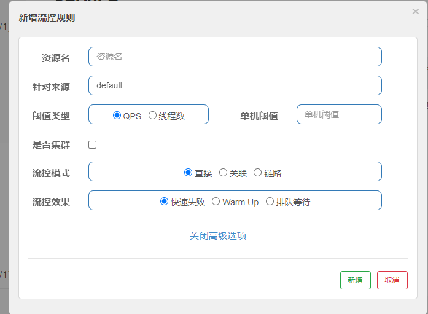

# 十七、SpringCloud Alibaba入门简介

### Netflix进入维护模式

解决合理bug,其余不再更新

## Spring Alibaba简介

Spring官网：https://spring.io/projects/spring-cloud-alibaba
GitHub：https://github.com/alibaba/spring-cloud-alibaba
GitHub中文文档：https://github.com/alibaba/spring-cloud-alibaba/blob/master/README-zh.md
Spring Cloud Alibaba参考文档：https://spring-cloud-alibaba-group.github.io/github-pages/greenwich/spring-cloud-alibaba.html


# 十八、SpringCloud Alibaba Nacos服务注册和配置中心

Nacos

官网：[https://nacos.io/zh-cn/](https://nacos.io/zh-cn/)
GitHub：https://github.com/alibaba/Nacos

各注册中心比较

| 服务注册与发现框架 | CAP模型 | 控制台管理 | 社区活跃度 |
| ------------------ | ------- | ---------- | ---------- |
| Eureka             | AP      | 支持       | 低         |
| Zookeeper          | CP      | 不支持     | 中         |
| Consul             | CP      | 支持       | 高         |
| Nacos              | AP      | 支持       | 高         |


## 安装并运行nacos

在docker上安装nacos

```sh
docker pull nacos/nacos-server
```

运行nacos,(启动报错了。。。关闭之前不用的docker，重启正常了)

```sh
docker run --env MODE=standalone --name nacos -d -p 8848:8848 nacos/nacos-server
```

浏览器输入：`http://10.0.41.31:8848/nacos/`。默认账号密码nacos


## Nacos作为服务注册中心演示

官方文档：https://spring-cloud-alibaba-group.github.io/github-pages/greenwich/spring-cloud-alibaba.html


1. 新建模块cloudalibaba-provider-payment9001

2. pom

   ```xml
   <dependencies>
       <dependency>
           <groupId>com.alibaba.cloud</groupId>
           <artifactId>spring-cloud-starter-alibaba-nacos-discovery</artifactId>
       </dependency>
       <dependency>
           <groupId>org.springframework.boot</groupId>
           <artifactId>spring-boot-starter-web</artifactId>
       </dependency>
       <dependency>
           <groupId>org.springframework.boot</groupId>
           <artifactId>spring-boot-starter-actuator</artifactId>
       </dependency>
       <dependency>
           <groupId>org.springframework.boot</groupId>
           <artifactId>spring-boot-starter-test</artifactId>
           <scope>test</scope>
       </dependency>
       <dependency>
           <groupId>org.springframework.boot</groupId>
           <artifactId>spring-boot-devtools</artifactId>
           <scope>runtime</scope>
           <optional>true</optional>
       </dependency>
   </dependencies>
   ```

3. yml

   ```yml
   server:
     port: 9001
   spring:
     application:
       name: nacos-payment-provider
     cloud:
       nacos:
         discovery:
           server-addr: 10.0.41.31:8848
   management:
     endpoints:
       web:
         exposure:
           include: '*'
   ```

4. 主启动类

   ```java
   @EnableDiscoveryClient
   @SpringBootApplication
   public class PaymentMain9001 {
       public static void main(String[] args) {
           SpringApplication.run(PaymentMain9001.class,args);
       }
   }
   ```

5. 新建controller.PaymentController

   ```java
   @EnableDiscoveryClient
   @SpringBootApplication
   public class PaymentMain9001 {
       public static void main(String[] args) {
           SpringApplication.run(PaymentMain9001.class,args);
       }
   }
   ```

6. 测试 启动9001

7. 参照9001新建9002，建立提供者集群启动


### 基于Nacos的服务消费者

1. 新建模块cloudalibaba-consumer-nacos-order83

2. pom（nacos集成了ribbon，实现负载均衡）

   ```xml
   <dependencies>
       <!-- spring cloud alibaba nacos -->
       <dependency>
           <groupId>com.alibaba.cloud</groupId>
           <artifactId>spring-cloud-starter-alibaba-nacos-discovery</artifactId>
       </dependency>
       <dependency>
           <groupId>com.xiaotu.cloud</groupId>
           <artifactId>cloud-api-common</artifactId>
           <version>${project.version}</version>
       </dependency>
       <dependency>
           <groupId>org.springframework.boot</groupId>
           <artifactId>spring-boot-starter-web</artifactId>
       </dependency>
       <dependency>
           <groupId>org.springframework.boot</groupId>
           <artifactId>spring-boot-starter-actuator</artifactId>
       </dependency>
       <dependency>
           <groupId>org.springframework.boot</groupId>
           <artifactId>spring-boot-devtools</artifactId>
           <scope>runtime</scope>
           <optional>true</optional>
       </dependency>
       <dependency>
           <groupId>org.springframework.boot</groupId>
           <artifactId>spring-boot-starter-test</artifactId>
           <scope>test</scope>
       </dependency>
   
   </dependencies>
   ```

3. yml

   ```yml
   server:
     port: 83
   spring:
     application:
       name: nacos-order-consumer
     cloud:
       nacos:
         discovery:
           server-addr: 10.0.41.31:8848
   
   #消费者要访问的微服务名称（成功注册nacos的服务提供者）
   service-url:
     nacos-user-service: http://nacos-payment-provider
   
   ```

4. 主启动类

   ```java
   @EnableDiscoveryClient
   @SpringBootApplication
   public class OrderNacosMain83 {
       public static void main(String[] args) {
           SpringApplication.run(OrderNacosMain83.class,args);
       }
   }
   ```

5. 新建config.ApplicationContextConfig

   ```java
   @Configuration
   public class ApplicationContextConfig {
   
       @Bean
       @LoadBalanced
       public RestTemplate getRestTemplate() {
           return new RestTemplate();
       }
   }
   ```

6. 新建controller.OrderNacosController

   ```java
   @Slf4j
   @RestController
   public class OrderNacosController {
       @Resource
       private RestTemplate restTemplate;
   
       @Value("${service-url.nacos-user-service}")
       private String serverURL;
   
   
       @GetMapping("/consumer/payment/nacos/{id}")
       public String paymentInfo(@PathVariable("id") Long id){
           return restTemplate.getForObject(serverURL + "/payment/nacos/" + id, String.class);
       }
       
   }
   ```

7. 测试 启动9001 9002 83

   

### 整合Feign


1. pom添加

   ```xml
   <!-- openfeign -->
   <dependency>
       <groupId>org.springframework.cloud</groupId>
       <artifactId>spring-cloud-starter-openfeign</artifactId>
   </dependency>
   ```

2. 在主启动类上加上`@EnableFeignClients`，激活feign。

3. 注释掉config配置类的`@Configuration`注解，不使用RestTemplate。

4. 新建service.PaymentFeignService接口

   ```java
   @Component
   @FeignClient(value = "nacos-payment-provider")
   public interface PaymentFeignService {
   
       @GetMapping("/payment/nacos/{id}")
       public String getPayment(@PathVariable("id") Integer id);
   }
   ```

5. 修改OrderNacosController

   ```java
   @Slf4j
   @RestController
   public class OrderNacosController {
   //    @Resource
   //    private RestTemplate restTemplate;
   
       @Value("${service-url.nacos-user-service}")
       private String serverURL;
   
       @Resource
       private PaymentFeignService paymentFeignService;
   
   
   //    @GetMapping("/consumer/payment/nacos/{id}")
   //    public String paymentInfo(@PathVariable("id") Long id){
   //        return restTemplate.getForObject(serverURL + "/payment/nacos/" + id, String.class);
   //    }
   
       @GetMapping("/consumer/payment/feign/nacos/{id}")
       public String paymentInfo2(@PathVariable("id") Integer id){
           return paymentFeignService.getPayment(id);
       }
   
   }
   ```

6. 重启测试

   

### 服务注册中心对比

来源：https://nacos.io/zh-cn/docs/what-is-nacos.html

#### Nacos生态图


CAP

A:可用性

C:一致性

P:分区容错性

Nacos默认AP  可切换成CP

curl -X PUT '$NACOS_SERVER:8848/nacos/v1/ns/operator/switchers?entry=serverMode&vaule=CP'

## Nacos作为服务配置中心演示

1. 新建模块cloudalibaba-config-nacos-client3377

2. pom

   ```xml
   <dependencies>
           <!-- nacos config-->
           <dependency>
               <groupId>com.alibaba.cloud</groupId>
               <artifactId>spring-cloud-starter-alibaba-nacos-config</artifactId>
           </dependency>
           <dependency>
               <groupId>com.alibaba.cloud</groupId>
               <artifactId>spring-cloud-starter-alibaba-nacos-discovery</artifactId>
           </dependency>
           <dependency>
               <groupId>org.springframework.cloud</groupId>
               <artifactId>spring-cloud-starter-openfeign</artifactId>
           </dependency>
           <dependency>
               <groupId>org.springframework.boot</groupId>
               <artifactId>spring-boot-starter-web</artifactId>
           </dependency>
           <dependency>
               <groupId>org.springframework.boot</groupId>
               <artifactId>spring-boot-devtools</artifactId>
               <scope>runtime</scope>
               <optional>true</optional>
           </dependency>
           <dependency>
               <groupId>org.springframework.boot</groupId>
               <artifactId>spring-boot-starter-test</artifactId>
               <scope>test</scope>
           </dependency>
       </dependencies>
   ```

3. xml

   Nacos同SpringCloud config一样，项目初始化时，要保证先从配置中心进行配置拉取，拉取配置后，才能保证项目的正常启动。

   springboot中配置文件的加载是存在优先级的，bootstrap优先级高于application。

   bootstrap.yml

   ```yml
   server:
     port: 3377
   spring:
     application:
       name: nacos-config-client
     cloud:
       nacos:
         discovery:
           server-addr: 10.0.41.31:8848
         config:
           server-addr: 10.0.41.31:8848
           file-extension: yml
   ```

   application.yml

   ```yml
   spring:
     profiles:
       active: dev #开发环境
   ```

4. 主启动类

   ```java
   @EnableDiscoveryClient
   @SpringBootApplication
   public class NacosConfigClientMain3377 {
       public static void main(String[] args) {
           SpringApplication.run(NacosConfigClientMain3377.class, args);
       }
   }
   ```

5. 新增controller.ConfigClientController

   ```java
   @RefreshScope //支持Nacos动态刷新
   @RestController
   public class ConfigClientController {
   
       @Value("${config.info}")
       private String configInfo;
   
       @GetMapping("/config/info")
       public String getConfigInfo() {
           return configInfo;
       }
   }
   ```

6. nacos中添加配置

   https://nacos.io/zh-cn/docs/quick-start-spring-cloud.html

   `${prefix}-${spring.profile.active}.${file-extension}`

   - `prefix` 默认为 `spring.application.name` 的值，也可以通过配置项 `spring.cloud.nacos.config.prefix`来配置。
   - `spring.profiles.active` 即为当前环境对应的 profile，详情可以参考 [Spring Boot文档](https://docs.spring.io/spring-boot/docs/current/reference/html/boot-features-profiles.html#boot-features-profiles)。 **注意：当 `spring.profiles.active` 为空时，对应的连接符 `-` 也将不存在，dataId 的拼接格式变成 `${prefix}.${file-extension}`**
   - `file-exetension` 为配置内容的数据格式，可以通过配置项 `spring.cloud.nacos.config.file-extension` 来配置。目前只支持 `properties` 和 `yaml` 类型。

   

7. 测试 启动3377 访问 http://localhost:3377/config/info

   

   注意：视频报错，老版不兼容nacos-config-client-dev.yml，需修改为yaml.新版本两个后缀都支持，且独立

   

8. 修改yml文件的版本号。

   


### Nacos作为配置中心——分类配置


#### Namespace+Group+DataID三者的关系

1. 是什么

   类似java中package名和类名

   最外层namespace可以用于区分部署环境，Group和DataID逻辑上区分两个目标对象。

   命名空间用于进行租户粒度的配置隔离。不同的命名空间下，可以存在相同的 Group 或 Data ID 的配置。Namespace 的常用场景之一是不同环境的配置的区分隔离，例如开发测试环境和生产环境的资源（如配置、服务）隔离等。

2. 三者情况

   

   默认情况：

   Namespace=public,Group=DEFAULT_GROUP，默认Cluster是DEFAULT

   针对不同的配置

   ```yml
   #DataId方案  修改bootstrap里的spring.profiles.active 
   #Group方案   group
         config:
           server-addr: 10.0.41.31:8848
           file-extension: yaml
           #group: TEST_GROUP
           #namespace: 命名空间ID
   ```

   

   

   ## Nacos集群和持久化配置（重要）

   https://nacos.io/zh-cn/docs/deployment.html

   ### 官网说明

   https://nacos.io/zh-cn/docs/cluster-mode-quick-start.html

   

   ```sql
   /*
    * Copyright 1999-2018 Alibaba Group Holding Ltd.
    *
    * Licensed under the Apache License, Version 2.0 (the "License");
    * you may not use this file except in compliance with the License.
    * You may obtain a copy of the License at
    *
    *      http://www.apache.org/licenses/LICENSE-2.0
    *
    * Unless required by applicable law or agreed to in writing, software
    * distributed under the License is distributed on an "AS IS" BASIS,
    * WITHOUT WARRANTIES OR CONDITIONS OF ANY KIND, either express or implied.
    * See the License for the specific language governing permissions and
    * limitations under the License.
    */
   
   /******************************************/
   /*   数据库全名 = nacos_config   */
   /*   表名称 = config_info   */
   /******************************************/
   CREATE TABLE `config_info` (
     `id` bigint(20) NOT NULL AUTO_INCREMENT COMMENT 'id',
     `data_id` varchar(255) NOT NULL COMMENT 'data_id',
     `group_id` varchar(255) DEFAULT NULL,
     `content` longtext NOT NULL COMMENT 'content',
     `md5` varchar(32) DEFAULT NULL COMMENT 'md5',
     `gmt_create` datetime NOT NULL DEFAULT CURRENT_TIMESTAMP COMMENT '创建时间',
     `gmt_modified` datetime NOT NULL DEFAULT CURRENT_TIMESTAMP COMMENT '修改时间',
     `src_user` text COMMENT 'source user',
     `src_ip` varchar(50) DEFAULT NULL COMMENT 'source ip',
     `app_name` varchar(128) DEFAULT NULL,
     `tenant_id` varchar(128) DEFAULT '' COMMENT '租户字段',
     `c_desc` varchar(256) DEFAULT NULL,
     `c_use` varchar(64) DEFAULT NULL,
     `effect` varchar(64) DEFAULT NULL,
     `type` varchar(64) DEFAULT NULL,
     `c_schema` text,
     `encrypted_data_key` text NOT NULL COMMENT '秘钥',
     PRIMARY KEY (`id`),
     UNIQUE KEY `uk_configinfo_datagrouptenant` (`data_id`,`group_id`,`tenant_id`)
   ) ENGINE=InnoDB DEFAULT CHARSET=utf8 COLLATE=utf8_bin COMMENT='config_info';
   
   /******************************************/
   /*   数据库全名 = nacos_config   */
   /*   表名称 = config_info_aggr   */
   /******************************************/
   CREATE TABLE `config_info_aggr` (
     `id` bigint(20) NOT NULL AUTO_INCREMENT COMMENT 'id',
     `data_id` varchar(255) NOT NULL COMMENT 'data_id',
     `group_id` varchar(255) NOT NULL COMMENT 'group_id',
     `datum_id` varchar(255) NOT NULL COMMENT 'datum_id',
     `content` longtext NOT NULL COMMENT '内容',
     `gmt_modified` datetime NOT NULL COMMENT '修改时间',
     `app_name` varchar(128) DEFAULT NULL,
     `tenant_id` varchar(128) DEFAULT '' COMMENT '租户字段',
     PRIMARY KEY (`id`),
     UNIQUE KEY `uk_configinfoaggr_datagrouptenantdatum` (`data_id`,`group_id`,`tenant_id`,`datum_id`)
   ) ENGINE=InnoDB DEFAULT CHARSET=utf8 COLLATE=utf8_bin COMMENT='增加租户字段';
   
   
   /******************************************/
   /*   数据库全名 = nacos_config   */
   /*   表名称 = config_info_beta   */
   /******************************************/
   CREATE TABLE `config_info_beta` (
     `id` bigint(20) NOT NULL AUTO_INCREMENT COMMENT 'id',
     `data_id` varchar(255) NOT NULL COMMENT 'data_id',
     `group_id` varchar(128) NOT NULL COMMENT 'group_id',
     `app_name` varchar(128) DEFAULT NULL COMMENT 'app_name',
     `content` longtext NOT NULL COMMENT 'content',
     `beta_ips` varchar(1024) DEFAULT NULL COMMENT 'betaIps',
     `md5` varchar(32) DEFAULT NULL COMMENT 'md5',
     `gmt_create` datetime NOT NULL DEFAULT CURRENT_TIMESTAMP COMMENT '创建时间',
     `gmt_modified` datetime NOT NULL DEFAULT CURRENT_TIMESTAMP COMMENT '修改时间',
     `src_user` text COMMENT 'source user',
     `src_ip` varchar(50) DEFAULT NULL COMMENT 'source ip',
     `tenant_id` varchar(128) DEFAULT '' COMMENT '租户字段',
     `encrypted_data_key` text NOT NULL COMMENT '秘钥',
     PRIMARY KEY (`id`),
     UNIQUE KEY `uk_configinfobeta_datagrouptenant` (`data_id`,`group_id`,`tenant_id`)
   ) ENGINE=InnoDB DEFAULT CHARSET=utf8 COLLATE=utf8_bin COMMENT='config_info_beta';
   
   /******************************************/
   /*   数据库全名 = nacos_config   */
   /*   表名称 = config_info_tag   */
   /******************************************/
   CREATE TABLE `config_info_tag` (
     `id` bigint(20) NOT NULL AUTO_INCREMENT COMMENT 'id',
     `data_id` varchar(255) NOT NULL COMMENT 'data_id',
     `group_id` varchar(128) NOT NULL COMMENT 'group_id',
     `tenant_id` varchar(128) DEFAULT '' COMMENT 'tenant_id',
     `tag_id` varchar(128) NOT NULL COMMENT 'tag_id',
     `app_name` varchar(128) DEFAULT NULL COMMENT 'app_name',
     `content` longtext NOT NULL COMMENT 'content',
     `md5` varchar(32) DEFAULT NULL COMMENT 'md5',
     `gmt_create` datetime NOT NULL DEFAULT CURRENT_TIMESTAMP COMMENT '创建时间',
     `gmt_modified` datetime NOT NULL DEFAULT CURRENT_TIMESTAMP COMMENT '修改时间',
     `src_user` text COMMENT 'source user',
     `src_ip` varchar(50) DEFAULT NULL COMMENT 'source ip',
     PRIMARY KEY (`id`),
     UNIQUE KEY `uk_configinfotag_datagrouptenanttag` (`data_id`,`group_id`,`tenant_id`,`tag_id`)
   ) ENGINE=InnoDB DEFAULT CHARSET=utf8 COLLATE=utf8_bin COMMENT='config_info_tag';
   
   /******************************************/
   /*   数据库全名 = nacos_config   */
   /*   表名称 = config_tags_relation   */
   /******************************************/
   CREATE TABLE `config_tags_relation` (
     `id` bigint(20) NOT NULL COMMENT 'id',
     `tag_name` varchar(128) NOT NULL COMMENT 'tag_name',
     `tag_type` varchar(64) DEFAULT NULL COMMENT 'tag_type',
     `data_id` varchar(255) NOT NULL COMMENT 'data_id',
     `group_id` varchar(128) NOT NULL COMMENT 'group_id',
     `tenant_id` varchar(128) DEFAULT '' COMMENT 'tenant_id',
     `nid` bigint(20) NOT NULL AUTO_INCREMENT,
     PRIMARY KEY (`nid`),
     UNIQUE KEY `uk_configtagrelation_configidtag` (`id`,`tag_name`,`tag_type`),
     KEY `idx_tenant_id` (`tenant_id`)
   ) ENGINE=InnoDB DEFAULT CHARSET=utf8 COLLATE=utf8_bin COMMENT='config_tag_relation';
   
   /******************************************/
   /*   数据库全名 = nacos_config   */
   /*   表名称 = group_capacity   */
   /******************************************/
   CREATE TABLE `group_capacity` (
     `id` bigint(20) unsigned NOT NULL AUTO_INCREMENT COMMENT '主键ID',
     `group_id` varchar(128) NOT NULL DEFAULT '' COMMENT 'Group ID，空字符表示整个集群',
     `quota` int(10) unsigned NOT NULL DEFAULT '0' COMMENT '配额，0表示使用默认值',
     `usage` int(10) unsigned NOT NULL DEFAULT '0' COMMENT '使用量',
     `max_size` int(10) unsigned NOT NULL DEFAULT '0' COMMENT '单个配置大小上限，单位为字节，0表示使用默认值',
     `max_aggr_count` int(10) unsigned NOT NULL DEFAULT '0' COMMENT '聚合子配置最大个数，，0表示使用默认值',
     `max_aggr_size` int(10) unsigned NOT NULL DEFAULT '0' COMMENT '单个聚合数据的子配置大小上限，单位为字节，0表示使用默认值',
     `max_history_count` int(10) unsigned NOT NULL DEFAULT '0' COMMENT '最大变更历史数量',
     `gmt_create` datetime NOT NULL DEFAULT CURRENT_TIMESTAMP COMMENT '创建时间',
     `gmt_modified` datetime NOT NULL DEFAULT CURRENT_TIMESTAMP COMMENT '修改时间',
     PRIMARY KEY (`id`),
     UNIQUE KEY `uk_group_id` (`group_id`)
   ) ENGINE=InnoDB DEFAULT CHARSET=utf8 COLLATE=utf8_bin COMMENT='集群、各Group容量信息表';
   
   /******************************************/
   /*   数据库全名 = nacos_config   */
   /*   表名称 = his_config_info   */
   /******************************************/
   CREATE TABLE `his_config_info` (
     `id` bigint(20) unsigned NOT NULL,
     `nid` bigint(20) unsigned NOT NULL AUTO_INCREMENT,
     `data_id` varchar(255) NOT NULL,
     `group_id` varchar(128) NOT NULL,
     `app_name` varchar(128) DEFAULT NULL COMMENT 'app_name',
     `content` longtext NOT NULL,
     `md5` varchar(32) DEFAULT NULL,
     `gmt_create` datetime NOT NULL DEFAULT CURRENT_TIMESTAMP,
     `gmt_modified` datetime NOT NULL DEFAULT CURRENT_TIMESTAMP,
     `src_user` text,
     `src_ip` varchar(50) DEFAULT NULL,
     `op_type` char(10) DEFAULT NULL,
     `tenant_id` varchar(128) DEFAULT '' COMMENT '租户字段',
     `encrypted_data_key` text NOT NULL COMMENT '秘钥',
     PRIMARY KEY (`nid`),
     KEY `idx_gmt_create` (`gmt_create`),
     KEY `idx_gmt_modified` (`gmt_modified`),
     KEY `idx_did` (`data_id`)
   ) ENGINE=InnoDB DEFAULT CHARSET=utf8 COLLATE=utf8_bin COMMENT='多租户改造';
   
   
   /******************************************/
   /*   数据库全名 = nacos_config   */
   /*   表名称 = tenant_capacity   */
   /******************************************/
   CREATE TABLE `tenant_capacity` (
     `id` bigint(20) unsigned NOT NULL AUTO_INCREMENT COMMENT '主键ID',
     `tenant_id` varchar(128) NOT NULL DEFAULT '' COMMENT 'Tenant ID',
     `quota` int(10) unsigned NOT NULL DEFAULT '0' COMMENT '配额，0表示使用默认值',
     `usage` int(10) unsigned NOT NULL DEFAULT '0' COMMENT '使用量',
     `max_size` int(10) unsigned NOT NULL DEFAULT '0' COMMENT '单个配置大小上限，单位为字节，0表示使用默认值',
     `max_aggr_count` int(10) unsigned NOT NULL DEFAULT '0' COMMENT '聚合子配置最大个数',
     `max_aggr_size` int(10) unsigned NOT NULL DEFAULT '0' COMMENT '单个聚合数据的子配置大小上限，单位为字节，0表示使用默认值',
     `max_history_count` int(10) unsigned NOT NULL DEFAULT '0' COMMENT '最大变更历史数量',
     `gmt_create` datetime NOT NULL DEFAULT CURRENT_TIMESTAMP COMMENT '创建时间',
     `gmt_modified` datetime NOT NULL DEFAULT CURRENT_TIMESTAMP COMMENT '修改时间',
     PRIMARY KEY (`id`),
     UNIQUE KEY `uk_tenant_id` (`tenant_id`)
   ) ENGINE=InnoDB DEFAULT CHARSET=utf8 COLLATE=utf8_bin COMMENT='租户容量信息表';
   
   
   CREATE TABLE `tenant_info` (
     `id` bigint(20) NOT NULL AUTO_INCREMENT COMMENT 'id',
     `kp` varchar(128) NOT NULL COMMENT 'kp',
     `tenant_id` varchar(128) default '' COMMENT 'tenant_id',
     `tenant_name` varchar(128) default '' COMMENT 'tenant_name',
     `tenant_desc` varchar(256) DEFAULT NULL COMMENT 'tenant_desc',
     `create_source` varchar(32) DEFAULT NULL COMMENT 'create_source',
     `gmt_create` bigint(20) NOT NULL COMMENT '创建时间',
     `gmt_modified` bigint(20) NOT NULL COMMENT '修改时间',
     PRIMARY KEY (`id`),
     UNIQUE KEY `uk_tenant_info_kptenantid` (`kp`,`tenant_id`),
     KEY `idx_tenant_id` (`tenant_id`)
   ) ENGINE=InnoDB DEFAULT CHARSET=utf8 COLLATE=utf8_bin COMMENT='tenant_info';
   
   CREATE TABLE `users` (
   	`username` varchar(50) NOT NULL PRIMARY KEY,
   	`password` varchar(500) NOT NULL,
   	`enabled` boolean NOT NULL
   );
   
   CREATE TABLE `roles` (
   	`username` varchar(50) NOT NULL,
   	`role` varchar(50) NOT NULL,
   	UNIQUE INDEX `idx_user_role` (`username` ASC, `role` ASC) USING BTREE
   );
   
   CREATE TABLE `permissions` (
       `role` varchar(50) NOT NULL,
       `resource` varchar(255) NOT NULL,
       `action` varchar(8) NOT NULL,
       UNIQUE INDEX `uk_role_permission` (`role`,`resource`,`action`) USING BTREE
   );
   
   INSERT INTO users (username, password, enabled) VALUES ('nacos', '$2a$10$EuWPZHzz32dJN7jexM34MOeYirDdFAZm2kuWj7VEOJhhZkDrxfvUu', TRUE);
   
   INSERT INTO roles (username, role) VALUES ('nacos', 'ROLE_ADMIN');
   
   ```

   ```sh
   docker run -d \
   -e MODE=standalone  \
   -e SPRING_DATASOURCE_PLATFORM=mysql \
   -e MYSQL_SERVICE_HOST=127.0.0.1 \
   -e MYSQL_SERVICE_PORT=3306 \
   -e MYSQL_SERVICE_USER=root \
   -e MYSQL_SERVICE_PASSWORD=123456 \
   -e MYSQL_SERVICE_DB_NAME=nacos_config \
   --name nacos \
   -p 8848:8848 \
   nacos/nacos-server
   
   #其他docker命令
   docker run -d --name nacos \
   -p 8848:8848 --restart=always \
   -e JVM_XMS=256m -e JVM_XMX=256m \
   -e MODE=standalone -e SPRING_DATASOURCE_PLATFORM=mysql \
   -e MYSQL_SERVICE_HOST=localhost \
   -e MYSQL_SERVICE_PORT=3306 \
   -e MYSQL_SERVICE_DB_NAME=nacos_config \
   -e MYSQL_SERVICE_USER=root \
   -e MYSQL_SERVICE_PASSWORD=123456 \
   -e MYSQL_SERVICE_DB_PARAM="allowPublicKeyRetrieval=true&rewriteBatchedStatements=true&characterEncoding=UTF8&serverTimezone=UTC&connectTimeout=10000&socketTimeout=30000&autoReconnect=true&useSSL=false" nacos/nacos-server
   ```
   
   
   
   ```sh
   docker exec -it nacos bash
   
   less conf/application.properties
   #csdn上都是建议直接修改参数  确定遗漏的参数 修改docker命令
   #修改参数和docker传环境变量无差别 
   #查看文档docker内部localhost、127.0.0.1指定镜像本身，并找到宿主机上的mysql的内网地址 
   docker inspect mysql | grep IPAddress
   "172.17.0.3"
   用此地址代替127.0.0.1
   
   docker run -d \
   -e MODE=standalone  \
   -e SPRING_DATASOURCE_PLATFORM=mysql \
   -e MYSQL_SERVICE_HOST=172.17.0.3 \
   -e MYSQL_SERVICE_PORT=3306 \
   -e MYSQL_SERVICE_USER=root \
   -e MYSQL_SERVICE_PASSWORD=123456 \
   -e MYSQL_SERVICE_DB_NAME=nacos_config \
   --name nacos \
   -p 8848:8848 \
   nacos/nacos-server
   ```
   
   随便创建个配置 测试mysql存储
   
   
   
   Config_info表里有
   
   

# 十九、SpringCloud Alibaba Sentinel实现熔断与限流

官网：https://github.com/alibaba/sentinel
中文版：[https://github.com/alibaba/Sentinel/wiki/%E4%BB%8B%E7%BB%8D](https://github.com/alibaba/Sentinel/wiki/介绍)

- **丰富的应用场景**：Sentinel 承接了阿里巴巴近 10 年的双十一大促流量的核心场景，例如秒杀（即突发流量控制在系统容量可以承受的范围）、消息削峰填谷、集群流量控制、实时熔断下游不可用应用等。
- **完备的实时监控**：Sentinel 同时提供实时的监控功能。您可以在控制台中看到接入应用的单台机器秒级数据，甚至 500 台以下规模的集群的汇总运行情况。
- **广泛的开源生态**：Sentinel 提供开箱即用的与其它开源框架/库的整合模块，例如与 Spring Cloud、Apache Dubbo、gRPC、Quarkus 的整合。您只需要引入相应的依赖并进行简单的配置即可快速地接入 Sentinel。同时 Sentinel 提供 Java/Go/C++ 等多语言的原生实现。
- **完善的 SPI 扩展机制**：Sentinel 提供简单易用、完善的 SPI 扩展接口。您可以通过实现扩展接口来快速地定制逻辑。例如定制规则管理、适配动态数据源等。


文档：https://spring-cloud-alibaba-group.github.io/github-pages/greenwich/spring-cloud-alibaba.html#_spring_cloud_alibaba_sentinel

```dockerfile
docker search sentinel

docker pull bladex/sentinel-dashboard

docker run --name sentinel -d -p 8858:8858 8719:8719 bladex/sentinel-dashboard
```

登录http://10.0.41.31:8858/#/login，账号密码都为`sentinel`


内网linux连不到本地，本机jar包重启一个服务 


## 初始化演示工程

1. 新建模块cloudalibaba-sentinel-service8401

2. pom

   ```xml
       <dependencies>
           <dependency>
               <groupId>com.alibaba.cloud</groupId>
               <artifactId>spring-cloud-starter-alibaba-nacos-discovery</artifactId>
           </dependency>
          <dependency>
               <groupId>com.alibaba.csp</groupId>
               <artifactId>sentinel-datasource-nacos</artifactId>
           </dependency>
           <dependency>
               <groupId>com.alibaba.cloud</groupId>
               <artifactId>spring-cloud-starter-alibaba-sentinel</artifactId>
           </dependency>
           <dependency>
               <groupId>org.springframework.cloud</groupId>
               <artifactId>spring-cloud-starter-openfeign</artifactId>
           </dependency>
           <dependency>
               <groupId>org.springframework.boot</groupId>
               <artifactId>spring-boot-starter-web</artifactId>
           </dependency>
           <dependency>
               <groupId>org.springframework.boot</groupId>
               <artifactId>spring-boot-starter-actuator</artifactId>
           </dependency>
           <dependency>
               <groupId>org.springframework.boot</groupId>
               <artifactId>spring-boot-devtools</artifactId>
               <scope>runtime</scope>
               <optional>true</optional>
           </dependency>
           <dependency>
               <groupId>org.springframework.boot</groupId>
               <artifactId>spring-boot-starter-test</artifactId>
               <scope>test</scope>
           </dependency>
       </dependencies>
   ```

3. yml

   ```yaml
   server:
     port: 8401
   spring:
     application:
       name: cloudalibaba-sentinel-service
     cloud:
       nacos:
         discovery:
           #nacos服务注册中心地址
           server-addr: 10.0.41.31:8848
       sentinel:
         transport:
           #配置Sentinel dashboard 地址
           dashboard: 10.0.41.31:8858
           # 默认8719端口 假设被占用了 会自动冲8719+1，直到找到未被占用的端口
           port: 8719
   management:
     endpoints:
       web:
         exposure:
           include: '*'
   ```

4. 主启动类

   ```java
   @EnableDiscoveryClient
   @SpringBootApplication
   public class MainApp8401 {
       public static void main(String[] args) {
           SpringApplication.run(MainApp8401.class,args);
       }
   }
   ```

5. controller.FlowLimitController

   ```java
   @RestController
   public class FlowLimitController {
   
       @GetMapping("/testA")
       public String testA(){
           return "testA";
       }
   
       @GetMapping("/testB")
       public String testB(){
           return "testB";
       }
   }
   ```

6. 测试，启动8401，然后刷新sentinel后台页面（因为sentinel采用懒加载策略，所以需要调用服务后才在后台显示）

   `http://localhost:8401/testA`
   `http://localhost:8401/testB`


## 流控规则

- 资源名：唯一名称，默认请求路径
- 针对来源：Sentinel可以针对调用者进行限流，填写微服务名，默认default（不区分来源）
- 阈值类型/单机阈值：
  - QPS（每秒请求数量）：当调用该API的QPS达到阈值的时候，进行限流
  - 线程数：当调用该API的线程数达到阈值的时候，进行限流
- 是否集群： 不需要集群，暂不研究
- 流控模式
  - 直接：api达到限流条件时，直接限流
  - 关联：当关联的资源达到阈值，就限流自己
  - 链路：只记录指定链路上的流量（指定资源从入口资源进来的流量，如果达到阈值，就进行限流）【API级别针对来源】
- 流控效果
  - 快速失败：直接失败，抛异常
  - Warm Up：根据codeFactor（冷加载因子， 默认3）的值，从阈值/codeFactor,经过预热时长，才达到设置的QPS的阈值
  - 排队等待：匀速排队，让请求以匀速的速度通过，阈值类型必须是QPS，否则无效。




#### 阈值类型

##### QPS与线程数的区别

- 阈值类型/单机阈值
  - QPS
  - 线程数

QPS是直接挡在外面，而线程数是有多少个线程在处理，放进来后，有线程是空闲状态就对请求进行处理，都没空闲，就限流（关门打狗）。


##### 流控模式

**直接** 快速失败

**关联**

A去调用B，B如果资源不足了，就限流A。

此时不管调用多少次A都不会限流，而此时超过1秒调用1次B，则会限流A。


##### 链路

在网上搜关于链路的是用下面这个例子，然而显示不了限流的效果。

新建一个TestService

```java
@Service
public class TestService {
    @SentinelResource("getTest")
    public void getTest(){
        System.out.println("getTest()");
    }
}
```

controller

```java
@Resource
TestService testService;

@GetMapping("/testA")
public String testA(){
    testService.getTest();
    return "testA";
}

@GetMapping("/testB")
public String testB(){
    testService.getTest();
    return "testB";
}
```


##### 预热（Warm Up）

即预热/冷启动方式，当时系统长期处于低水位的情况下，当流量突然增加时。直接把系统升到高水位可能瞬间把系统压垮。通过“冷启动”，让通过的流量缓慢增加，再一定时间内逐渐增加到阈值上线，给冷系统一个预热的时间。避免冷系统被压垮。

#### 匀速排队

匀速排队 ( RuleConstant.CONTROL BEHAVIOR RATE LIMITER )方式会严格控制请求通过的间隔时间，也即是让请求以均匀的速度通过，对应的是漏桶算法。详细文档可以参考 流量控制 -匀速器模式，具体的例子可以参见 PaceFlowDemo。

这种方式主要用于处理间隔性突发的流量，例如消息队列。想象一下这样的场景，在某一秒有大量的请求到来，而接下来的几秒则处于空闲状态，我们希望系统能够在接下来的空闲期间逐渐处理这些请求，而不是在第一秒直接拒绝多余的请求


## 降级规则

我们通常用以下几种方式来衡量资源是否处于稳定的状态:

- 平均响应时间(DEGRADE_GRADE_RT :当1s 内持续进入N个请求，对应时刻的平均响应时间(秒级)均超过值( count ，以ms 为单位)，那么在接下的时间窗口( DegradeRule 中的 timewindow，以s 为单位)之内，对这个方法的调用都会自动地熔断(抛出 DegradeException )。注意 Sentinel 默认统计的 RT 上限是 4900 ms,超出此值的都会算作4900 ms，若需要变更此上限可以通过启动配置项 -Dcsp.sentinel.statistic,max,rt=xxx 来配置。
- 异常比例(DEGRADE GRADE EXCEPTION RATIO: 当资源的每秒请求量=N(可配置，并每秒异堂总数占通过量的比值超过闻值 ( DegradeRule 中的 count )之后，资源进入降级状态，即在接下的时间窗口( DeradeRule 中的timewindow ，以s 为单位)之内，对这个方法的调用都会自动地返回。异常比率的阑值范围是 0.0，1.0]，代表 0%100%。
- 异常数(DEGRADEGRADEEXCEPTION_COUNT): 当资源近1分钟的异常数目超过值之后会进行熔断。注意由于统计时间窗口是分钟级别的，若 timewindow 小于 60s，则结束熔断状态后仍可能再进入熔断状态。


RT (平均响应时间，秒级)
平均响应时间超出闽值 且在时间窗口内通过的请求>=5，两个条件同时满足后触发降级窗口期过后关闭断路器
RT最大4900 (更大的需要通过-Dcsp.sentinel.statistic.maxrt=XXXX才能生效)

异常比列 (秒级)
QPS>= 5 且异常比例(秒级统计)超过闻值时，触发降级:时间窗口结束后，关闭降级

异常数 (分钟级)
异常数 (分钟统计)超过闻值时，触发降级，时间窗口结束后，关闭降级


平均响应时间(DEGRADE_GRADE_RT ):当1s 内持续进入N个请求，对应时刻的平均响应时间(秒级)均超过值(count，以ms 为单位)，那么在接下的时间窗口 ( DegradeRule 中的 timewindow，以s 为单位)之内，对这个方法的调用都会自动地熔断(抛出 DegradeException )。注意 Sentinel 默认统计的 RT 上限是 4900 ms，超出此值的都会算作 4900 ms，若需要变更此上限可以通过启动配置项 -Dcsp.sentinel.statistic,max,rt=xxx 来配置。

```java
    @GetMapping("/testD")
    public String testD(){
        try {
            TimeUnit.SECONDS.sleep(1);
        }catch (InterruptedException e){
            e.printStackTrace();
        }
        log.info("testD 测试RT");
        return "----testD";
    }
```

启动8401，在浏览器输入`http://localhost:8080/testD`，然后在sentinel设置testD降级规则。


*请求处理完成的时间为200毫秒（阈值），超过这个时间熔断降级进入时间窗口期不处理请求，1秒后退出时间窗口期，继续处理请求。（前提是一秒请求数超过5个，如果请求数没超过5个，就算请求处理的时间超过阈值也不会熔断降级）*


## 热点key限流

何为热点?热点即经常访问的数据。很多时候我们希望统计某个热点数据中访问频次最高的 TopK 数据，并对其访问进行限制。比如:
商品ID 为参数，统计一段时间内最常购买的商品ID并进行限制。用户ID 为参数，针对一段时间内频繁访问的用户ID 进行限制.
热点参数限流会统计传入参数中的热点参数，并根据配置的限流闻值与模式，对包含热点参数的资源调用进行限流。热点参数限流可以看做是一种特殊的流量控制，仅对包含热点参数的资源调用生效
Sentinel Parameter Flow Control
Sentinel 利用LRU 策略统计最近最常访问的热点参数，结合令牌桶算法来进行参数级别的流控。热点参数限流支持集群模式。


兜底逻辑

FlowLimitController中添加：

```java
    @GetMapping("/testHotKey")
    @SentinelResource(value = "testHotKey",blockHandler = "deal_testHotKey")
    public String testHotKey(@RequestParam(value="p1",required = false) String p1,
                             @RequestParam(value="p2",required = false) String p2){
        return "hostkey";
    }

    //兜底方法
    public String deal_testHotKey(String p1, String p2, BlockException exception){
        return "--------deal_testHotKey------";
    }
```


重启8401，浏览器输入`http://localhost:8401/testHotKey`，然后在后台对testHotKey进行热点规则配置。


系统规则
Sentinel 系统自适应限流从整体维度对应用入口流量进行控制，结合应用的 Load、CPU 使用率、总体平均 RT、入口 QPS 和并发线程数等几个维度的监控指标，通过自适应的流控策略，让系统的入口流量和系统的负载达到一个平衡，让系统尽可能跑在最大吞吐量的同时保证系统整体的稳定性。
