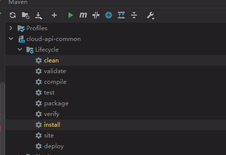

# 工程重构

观察问题：系统中有重复部分，重构。

1. 新建新工程：cloud-api-commons


2. 改pom

添加依赖：

```xml
    <dependencies>
        <dependency>
            <groupId>org.springframework.boot</groupId>
            <artifactId>spring-boot-devtools</artifactId>
        </dependency>
        <dependency>
            <groupId>org.projectlombok</groupId>
            <artifactId>lombok</artifactId>
        </dependency>
        <dependency>
            <groupId>cn.hutool</groupId>
            <artifactId>hutool-all</artifactId>
            <version>4.1.1</version>
        </dependency>
    </dependencies>
```


3.拷贝entities到本项目中（路径需要一样，先在本项目中建包，然后在拷贝）

4.对本项目进行打包



5. 删除另外两个项目的entities包。

6. 然后给两个项目引入打包后项目的坐标。

   ```xml
           <dependency>
               <groupId>com.xiaotu.cloud</groupId>
               <artifactId>cloud-api-common</artifactId>
               <version>${project.version}</version>
           </dependency>
   ```

7. 重新测试正常运行

8. 