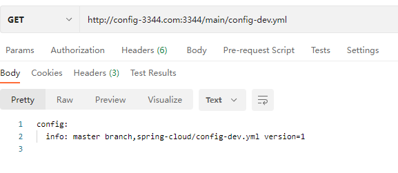

# SpringCloud Config分布式配置中心

github创建配置项目：https://github.com/cuixiaotu/cloud-config


1. 新建模块cloud-config-center-3344

2. pom

   ```xml
       <dependencies>
           <!--添加消息总线RabbitMQ的支持-->
   <!--        <dependency>
               <groupId>org.springframework.cloud</groupId>
               <artifactId>spring-cloud-starter-bus-amqp</artifactId>
           </dependency>-->
           <!--config server-->
           <dependency>
               <groupId>org.springframework.cloud</groupId>
               <artifactId>spring-cloud-config-server</artifactId>
           </dependency>
           <!--eureka client(通过微服务名实现动态路由)-->
           <dependency>
               <groupId>org.springframework.cloud</groupId>
               <artifactId>spring-cloud-starter-netflix-eureka-client</artifactId>
           </dependency>
           <dependency>
               <groupId>org.springframework.boot</groupId>
               <artifactId>spring-boot-starter-web</artifactId>
           </dependency>
           <dependency>
               <groupId>org.springframework.boot</groupId>
               <artifactId>spring-boot-starter-actuator</artifactId>
           </dependency>
           <!--热部署-->
           <dependency>
               <groupId>org.springframework.boot</groupId>
               <artifactId>spring-boot-devtools</artifactId>
               <scope>runtime</scope>
               <optional>true</optional>
           </dependency>
           <dependency>
               <groupId>org.projectlombok</groupId>
               <artifactId>lombok</artifactId>
               <optional>true</optional>
           </dependency>
           <dependency>
               <groupId>org.springframework.boot</groupId>
               <artifactId>spring-boot-starter-test</artifactId>
               <scope>test</scope>
           </dependency>
           <dependency>
               <groupId>cn.hutool</groupId>
               <artifactId>hutool-all</artifactId>
               <version>5.8.10</version>
               <scope>test</scope>
           </dependency>
       </dependencies>
   ```

3. yml

   ```yml
   server:
     port: 3344
   spring:
     application:
       name: cloud-config-center
     cloud:
       config:
         label: main #读取分支
         server:
           git:
             search-paths:
               - cloud-config
             uri: https://github.com/cuixiaotu/cloud-config.git
             username: 616364596@qq.com
             password: xxxxx
             default-label: main #由于XX原因。git改默认分支了
   eureka:
     client:
       healthcheck:
         enabled: true
       service-url:
         defaultZone: http://localhost:7001/eureka
   debug: true
   ```

   

4. 主启动类

   ```java
   @EnableConfigServer
   @SpringBootApplication
   public class ConfigCenterMain3344 {
       public static void main(String[] args) {
           SpringApplication.run(ConfigCenterMain3344.class,args);
       }
   }
   ```

5. 修改host

   ```tex
   127.0.0.1 config-3344.com
   ```

6. 启动7001，3344，请求：http://config-3344.com:3344/main/config-dev.yml



读取规则

1.http://config-3344.com:3344/master/config-test.yml

```tex
config:
  info: master branch,spring-cloud/config-dev.yml version=1
```


2.http://config-3344.com:3344/config-test.yml

```tex
config:
  info: master branch,spring-cloud/config-dev.yml version=1
```


3.http://config-3344.com:3344/config/test/master

```json
{
    "name": "config",
    "profiles": [
        "dev"
    ],
    "label": "main",
    "version": "6b0682e4deeb4ba5e710e2969c0648c48a13f71c",
    "state": null,
    "propertySources": [
        {
            "name": "https://github.com/cuixiaotu/cloud-config.git/config-dev.yml",
            "source": {
                "config.info": "master branch,spring-cloud/config-dev.yml version=1"
            }
        }
    ]
}
```


## Config客户端配置与测试

1. 新建模块cloud-config-client-3355

2. pom

   ```xml
   <dependencies>
           <dependency>
               <groupId>org.springframework.cloud</groupId>
               <artifactId>spring-cloud-starter-config</artifactId>
           </dependency>
           <dependency>
               <groupId>org.springframework.cloud</groupId>
               <artifactId>spring-cloud-starter-netflix-eureka-client</artifactId>
           </dependency>
           <dependency>
               <groupId>org.springframework.boot</groupId>
               <artifactId>spring-boot-starter-web</artifactId>
           </dependency>
           <dependency>
               <groupId>org.springframework.boot</groupId>
               <artifactId>spring-boot-starter-actuator</artifactId>
           </dependency>
           <dependency>
               <groupId>org.springframework.boot</groupId>
               <artifactId>spring-boot-devtools</artifactId>
               <scope>runtime</scope>
           </dependency>
           <dependency>
               <groupId>org.projectlombok</groupId>
               <artifactId>lombok</artifactId>
               <optional>true</optional>
           </dependency>
           <dependency>
               <groupId>org.springframework.boot</groupId>
               <artifactId>spring-boot-starter-test</artifactId>
               <scope>test</scope>
           </dependency>
       </dependencies>
   ```

3. bootstrap.yml

   ```yml
   server:
     port: 3355
   
   spring:
     application:
       name: config-client
     cloud:
       config:
         label: main
         name: config
         profile: dev
         uri: http://localhost:3344
   
   eureka:
     client:
       service-url:
         defaultZone: http://localhost:7001/eureka
   
   management:
     endpoint:
       web:
         exposure:
           include: "*"
   
   ```

4. 主配置类

   ```java
   @EnableEurekaClient
   @SpringBootApplication
   public class ConfigClientMain3355 {
       public static void main(String[] args) {
           SpringApplication.run(ConfigClientMain3355.class, args);
       }
   }
   ```

5. controller

   ```java
   @RefreshScope
   @RestController
   public class ConfigClientController {
   
       @Value("${config.info}")
       private String configInfo;
   
       @GetMapping("/configInfo")
       public String getConfigInfo() {
           return configInfo;
       }
   
   }
   ```

6. 测试

   

   访问：http://config-3344.com:3344/config-dev.yml

   

   访问：http://localhost:3355/configInfo

   


### 动态刷新问题

1. 修改github上的config-dev.yml文件的版本号为2

2. 刷新http://config-3344.com:3344/main/config-dev.yml,版本号发生改变（这里也有缓存 过了下就生效）

3. 刷新http://localhost:3355/configInfo没有改变

4. 重启3355后生效

   

Config客户端动态刷新

1. 在config客户端3355 pom添加

   ```xml
   <dependency>
   	<group>org.springframework.boot</group>
     <artifactId>spring-boot-starter-actuator</artifactId>
   </dependency>
   ```

2. Bootstrap.yml添加

   ```yml
   management:
     endpoints:
       web:
         exposure:
           include: '*' #注意单引号！！！
   ```

3. 在ConfigClientController类上添加@RefreshScope注解

4. 重启335

5. 修改github版本号，访问3344和3355

   

   

   

   

   


