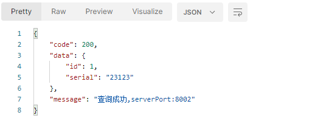
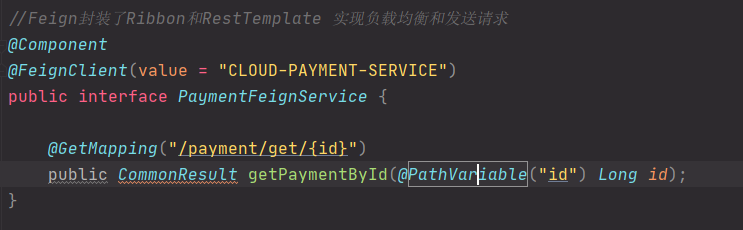
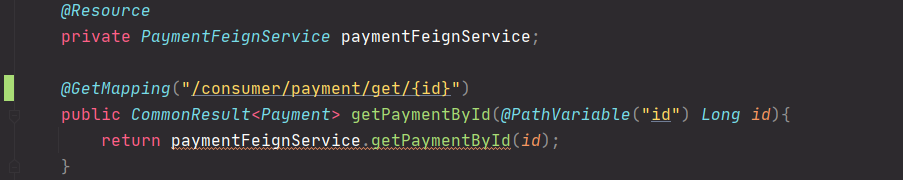
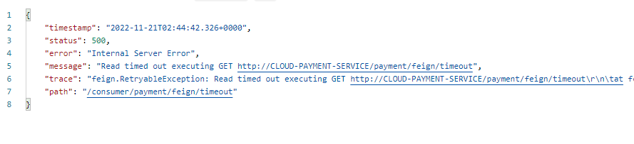
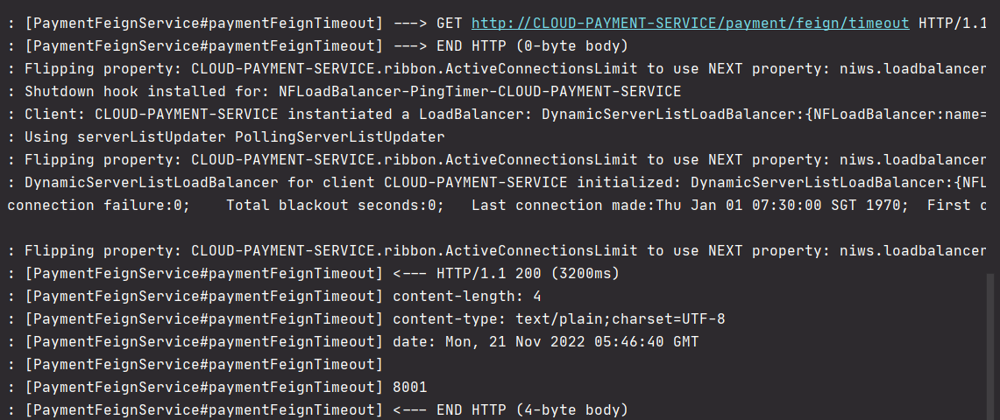

# OpenFeign服务接口调用


简介

官网文档：https://cloud.spring.io/spring-cloud-static/Hoxton.SR1/reference/htmlsingle/#spring-cloud-openfeign

Feign是一个声明式WebService服务器，使用Feign能让编写Web Service客户端更加简单。定义一个服务接口然后在上面添加注解。Feign也支持可拔插式的编码器和解码器。Spring Cloud对Feign进行封装，使支持Spring MVC标注注解和HttpMessageConverters。Feign可以对Eureka和Ribbon组合使用以支持负载均衡。


前面在使用Ribbon+RestTemplate时，利用RestTempalte对http请求的封装处理，形成了一套模板式的调用方法。实际使用中。由于对服务依赖的调用可能不止一处，往往一个接口会被多处调用，所以通常会针对每个微服务自行封装一些客户端来包装这些服务的调用。所以Feign在此基础上进一步封装，由他来帮助我们定义和实现服务接口的定义，在Feign的实现下，我们只需要创建一个接口并使用注解的方式来配置它（以前是Dao接口上标注Mapper注解，现在是一个微服务接口上面标注一个Feign注解即可），即可完成对服务提供方的接口绑定，简化使用了Spring cloud Ribbon时，自动封装服务调用客户端的开发量。


Feign和OpenFeign的区别

| Feign                                                        | OpenFeign                                                    |
| ------------------------------------------------------------ | ------------------------------------------------------------ |
| Feign是Spring Cloud组件中一个轻量级RESTful的HTTP服务客户端。Feign内置了Ribbon,用来做客户端负载均衡，去调用服务注册中心的服务。Feign的使用方式：使用Feign的注解定义接口，调用这个接口，就可以调用服务注册中心的服务 | OpenFeign是Spring Cloud在Feign的基础上支持了SpringMVC的注解，如RequestMapping等。OpenFeign的@FeignClient可以解析SpringMVC的@RequestMapping注解下的接口，并通过动态代理方式产生实现类，实现类中做负载均衡并调用其他服务。 |
| spring-cloud-start-feign                                     | Spring-cloud-start-openfeign                                 |


1. 新建模块cloud-consumer-feign-order80

2. pom

   ```xml
    <dependencies>
           <dependency>
               <groupId>org.springframework.cloud</groupId>
               <artifactId>spring-cloud-starter-openfeign</artifactId>
           </dependency>
           <dependency>
               <groupId>org.springframework.cloud</groupId>
               <artifactId>spring-cloud-starter-netflix-eureka-client</artifactId>
           </dependency>
   
           <dependency>
               <groupId>com.xiaotu.cloud</groupId>
               <artifactId>cloud-api-common</artifactId>
               <version>${project.version}</version>
           </dependency>
           <dependency>
               <groupId>org.springframework.boot</groupId>
               <artifactId>spring-boot-starter-web</artifactId>
           </dependency>
           <dependency>
               <groupId>org.springframework.boot</groupId>
               <artifactId>spring-boot-starter-actuator</artifactId>
           </dependency>
   
           <dependency>
               <groupId>org.springframework.boot</groupId>
               <artifactId>spring-boot-starter-test</artifactId>
           </dependency>
   
       </dependencies>
   ```

3. yml

   ```yml
   server:
     port: 80
   
   eureka:
     client:
       register-with-eureka: true
       service-url:
         defaultZone: http://eureka7001.com:7001/eureka,http://eureka7002.com:7002/eureka,http://eureka7003.com:7003/eureka
   ```

4. 新建service.PaymentFeignService接口类

   ```java
   //Feign封装了Ribbon和RestTemplate 实现负载均衡和发送请求
   @Component
   @FeignClient(value = "CLOUD-PAYMENT-SERVICE")
   public interface PaymentFeignService {
   
       @GetMapping("/payment/get/{id}")
       public CommonResult getPaymentById(@PathVariable("id") Long id);
   }
   ```

5. 主启动类

   ```java
   @EnableFeignClients //激活Feign
   @SpringBootApplication
   public class OrderFeignMain80 {
   
       public static void main(String[] args) {
           SpringApplication.run(OrderFeignMain80.class,args);
       }
   }
   ```

6. controller.OrderFeignController

   ```java
   @Slf4j
   @RestController
   public class OrderFeignController {
   
       @Resource
       private PaymentFeignService paymentFeignService;
   
       @GetMapping("/consumer/payment/get/{id}")
       public CommonResult<Payment> getPaymentById(@PathVariable("id") Long id){
           return paymentFeignService.getPaymentById(id);
       }
   
   }
   ```

7. 访问http://localhost/consumer/payment/get/1



总结：

消费者



提供者




OpenFeign超时控制

提供者在处理服务时哟改好了三秒，提供者认为3秒正常，而消费者只愿意等一秒。1秒后，提供者会没返回数据，消费者认为超时。双方约定超时时间。

模拟超时


1. 在8001的PaymentController里添加：

   ```java
   @GetMapping("/payment/feign/timeout")
   public String paymentFeignTimeout() {
       try {
           TimeUnit.SECONDS.sleep(3);
       }catch (InterruptedException e) {
           e.printStackTrace();
       }
       return serverPort;
   }
   ```
   
2. 在80的PaymentFeignService

   ```java
   @GettingMapping("/payment/feign/timeout")
   public String paymentFeignTimeout();
   ```

3. 在80的OrderFeignController

   ```java
   @GettingMapping("/consumer/payment/feign/timeout")
   ```

4. 启动相关项目 访问http://localhost/consumer/payment/feign/timeout

5. 在80yml中添加配置

   ```yml
   ribbon:
     ReadTimeout: 5000
     connectTimeout: 5000
   ```

6. 重新访问`http://localhost/consumer/payment/feign/timeout`，3秒后显示。


## OpenFeign日志打印功能

### 步骤

1. 配置日志bean
   在80的springcloud包下新建config.FeignConfig

2. 在80的yml文件中添加：

   ```yml
   #开启日志的feign客户端
   logging:
     level:
       com.xiaotu.cloud.service.PaymentFeignService: debug
   ```

3. 启动

   
