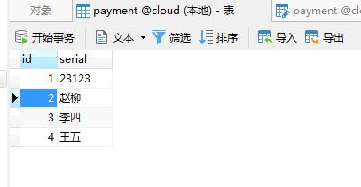

#  微服务消费者订单module模块cloud-consumer-order80

1.新建模块 cloud-consumer-order80

2.修改pom
```xml
 <dependencies>
        <dependency>
            <groupId>org.springframework.boot</groupId>
            <artifactId>spring-boot-starter-web</artifactId>
        </dependency>
        <dependency>
            <groupId>org.springframework.boot</groupId>
            <artifactId>spring-boot-starter-actuator</artifactId>
        </dependency>

        <dependency>
            <groupId>org.projectlombok</groupId>
            <artifactId>lombok</artifactId>
            <optional>true</optional>
        </dependency>
        <dependency>
            <groupId>org.springframework.boot</groupId>
            <artifactId>spring-boot-starter-test</artifactId>
            <scope>test</scope>
        </dependency>
    </dependencies>
```

3.写yml
 在resources目录下新建application.yml文件
 ```yml
server:
  port: 80 
 ```

4.主启动
```java
@SpringBootApplication
public class OrderMain80 {
    public static void main(String[] args) {
        SpringApplication.run(OrderMain80.class,args);
    }
}
```

5.业务
- 复制cloud-provider-payment8001项目里的entities（里面2个实体类）到本项目（cloud-consumer-order80）的springcloud包下。
（在后面的工程重构，会抽取实体类，当前代码已抽离，如需请查看cloud-api-common模块）

- 在springcloud包下新建config.ApplicationContextConfig
```java
@Configuration
public class ApplicationContextConfig {

    //从容器中添加一个RestTemplate
    //RestTemplate提供多种便捷方式访问远程http的方法
    @Bean
    public RestTemplate restTemplate(){
        return new RestTemplate();
    }

}
```
3.在springcloud包下新建controller.OrderController

```java
@RestController
@Slf4j
public class OrderController {

    private static final String PAYMENT_URL= "http://localhost:8001";

    @Autowired
    private RestTemplate restTemplate;

    @GetMapping("/consumer/payment/create")
    public CommonResult<Payment> create(Payment payment){
        log.info("插入的数据="+payment);
        return restTemplate.postForObject(PAYMENT_URL+"/payment/create",payment,CommonResult.class);
    }

    @GetMapping("/consumer/payment/get/{id}")
    public CommonResult<Payment> getPayment(@PathVariable("id") Long id){
        log.info("查询id="+id);
        return restTemplate.getForObject(PAYMENT_URL+"/payment/id/" +id,CommonResult.class);
    }

}
```

6.测试
一起运行后，右下角展示的service提示，点show,会出现services tab

请求测试接口
http://localhost/consumer/payment/get/2


http://localhost/consumer/payment/create?serial=王五



