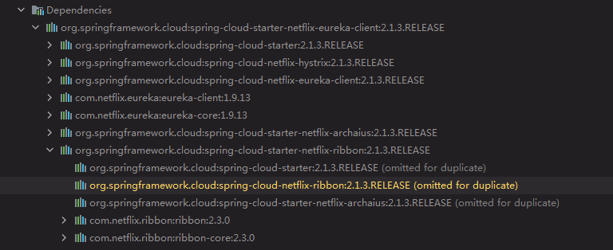
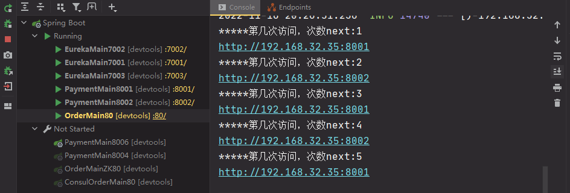

# Ribbon 负载均衡

恢复erueka环境

是什么

Spring Cloud Ribbon是基于Netflix Robbon实现质的一套客户端 负载均衡工具。

简单来说,Ribbon是Netflix发起的开源项目，主要功能是提供客户顿软件负载均衡算法和服务调用。Ribbon客户端组件提供一系列的配置项如：连接超时，重试等。简单来说，就是在配置文件中列出Load Balancer（LB）后面的机器，Ribbon会自动帮助你基于某种规则（如简单轮询，随机等）去连接这些机器。

负载均衡

LB负载均衡是什么

简单来说就是把用户请求平摊分配到多个服务器上，从而达到系统的HA（高可用）

常见的负载均衡有软件Nginx，LVS，硬件 F5等。


Ribbon本地负载均衡 VS Nginx服务端负载均衡

Nginx是服务端负载均衡，客户端所有请求都会交给Nginx，然后Nginx实现转发请求。即负载均衡是由服务端实现的。

Ribbon本地负载均衡，在调用微服务接口时候，会在注册中心获取信息服务列表之后缓存到JVM本地，从而实现本地RPC远程服务调用技术。


集中式LB

即在服务消费方和提供方之间提供独立的LB设施（硬件如F5.软件nginx），由该设施负责把访问请求通过某种策略转发至服务的提供方。

进程内LB

把LB逻辑集成到消费方，消费方从服务注册中心获知有哪些地址可用，然后自己再从这些地址中选择出一个合适的服务器。


eureka依赖以及集成了Ribbon依赖



RestTemplate

@LoadBalanced注解给RestTemplate开启负载均衡的能力

官方文档：https://docs.spring.io/spring-framework/docs/5.2.2.RELEASE/javadoc-api/org/springframework/web/client/RestTemplate.html

controller增加相关代码

```java
    @GetMapping("/consumer/payment/getEntity/{id}")
    public CommonResult<Payment> getEntity(@PathVariable("id") Long id){
        log.info("查询 Entity id="+id);
        ResponseEntity<CommonResult> entity =  restTemplate.getForEntity(PAYMENT_URL+"/payment/get/" +id,CommonResult.class);
        if (entity.getStatusCode().is2xxSuccessful()){
            return entity.getBody();
        }else {
            return new CommonResult<>(444,"操作失败");
        }
    }

    @GetMapping("/consumer/payment/createEntity")
    public CommonResult<Payment> createEntity(Payment payment){
        log.info("插入的数据 Entity="+payment);
        ResponseEntity<CommonResult> entity = restTemplate.postForEntity(PAYMENT_URL+"/payment/create/",payment,CommonResult.class);
        if (entity.getStatusCode().is2xxSuccessful()){
            return entity.getBody();
        }else {
            return new CommonResult<>(444,"操作失败");
        }
    }

```

默认为RoundRobinRule轮询。 可以看出请求每次端口切换。

Ribbon的自定义配置类不可以放在@ComponentScan所扫描的当前包下以及子包下，否则这个自定义配置类就会被所有的Ribbon客户端共享，达不到为指定的Ribbon定制配置，而@SpringBootApplication注解里就有@ComponentScan注解，所以不可以放在主启动类所在的包下。（因为Ribbon是客户端（消费者）这边的，所以Ribbon的自定义配置类是在客户端（消费者）添加，不需要在提供者或注册中心添加）

```java
package com.xiaotu.myrule;

import com.netflix.loadbalancer.IRule;
import com.netflix.loadbalancer.RandomRule;
import org.springframework.context.annotation.Bean;
import org.springframework.context.annotation.Configuration;

@Configuration
public class MySelfRule {

    @Bean
    public IRule myRule(){
        return new RandomRule(); //随机
    }
}
```

在主启动类上添加`@RibbonClient(name = "CLOUD-PAYMENT-SERVICE", configuration = MySelfRule.class)`

name为指定的服务名（服务名必须与注册中心显示的服务名大小写一致）
configuration为指定服务使用自定义配置（自定义负载均衡机制）

启动eurekaserver集群，提供者集群，消费者。

浏览器输入`http://localhost/consumer/payment/get/1`，多次刷新实现负载均衡为随机。


### RoundRobinRule源码

```java
public class RoundRobinRule extends AbstractLoadBalancerRule {
	//AtomicInteget 原子整型类
    private AtomicInteger nextServerCyclicCounter;
    private static final boolean AVAILABLE_ONLY_SERVERS = true;
    private static final boolean ALL_SERVERS = false;

    private static Logger log = LoggerFactory.getLogger(RoundRobinRule.class);

    public RoundRobinRule() {
        //nextServerCyclicCounter是一个原子整形类 且value为0
        nextServerCyclicCounter = new AtomicInteger(0);
    }

    public RoundRobinRule(ILoadBalancer lb) {
        this();
        setLoadBalancer(lb);
    }

    //ILoadBalance选择的负载均衡机制，这里lb为轮询
    public Server choose(ILoadBalancer lb, Object key) {
        if (lb == null) {
            log.warn("no load balancer");
            return null;
        }

        Server server = null;
        int count = 0;
        //还没选到执行的server 并且选择的次数没超过10 进行选择server
        while (server == null && count++ < 10) {
            //获取所有状态是up的服务实例
            List<Server> reachableServers = lb.getReachableServers();
            //获取所有服务实例
            List<Server> allServers = lb.getAllServers();
            int upCount = reachableServers.size();
            int serverCount = allServers.size();
            //如果服务数或可用服务数为0 打印日志并返回
            if ((upCount == 0) || (serverCount == 0)) {
                log.warn("No up servers available from load balancer: " + lb);
                return null;
            }
            //获取server下标
            int nextServerIndex = incrementAndGetModulo(serverCount);
            //获取下一个服务
            server = allServers.get(nextServerIndex);

            if (server == null) {
                /* Transient. */
                //线程让步 线程让出CPU执行权 让自己或其他线程执行（让步后可能会还是当前线程）
                Thread.yield();
                continue;
            }
            //如果server还活着 则返回
            if (server.isAlive() && (server.isReadyToServe())) {
                return (server);
            }

            // Next.
            server = null;
        }

        //选择超过十次 打印日志 并返回null
        if (count >= 10) {
            log.warn("No available alive servers after 10 tries from load balancer: "
                    + lb);
        }
        return server;
    }

    /**
     * Inspired by the implementation of {@link AtomicInteger#incrementAndGet()}.
     *
     * @param modulo The modulo to bound the value of the counter.
     * @return The next value.
     */
    private int incrementAndGetModulo(int modulo) {
        //cas加自旋锁
        //cas(Compare And Awap) 是用于实现多线程同步的原子命令。CAS机制当中使用了三个基本操作数。
        //内存地址V 旧的预期值A 要修改的新值B。更新一个变量的预期值A和内存地址V当中的实际值相同时，才会把内存地址V对应的值修改为B。
        //自旋锁 是指当一个线程在获取锁的时候 如果锁已经被其他进程获取，那么该线程将循环等待，然后不断判断锁是否能够被成功获取，知道获取到锁才会退出循环。
        for (;;) {
            //获取value 即0
            int current = nextServerCyclicCounter.get();
            //取余 为1
            int next = (current + 1) % modulo;
            //进行CAS判断 如果此时在value的内存地址中 如果value和current相同则为true 返回next的值 否则就一直循环，直到结果为true
            if (nextServerCyclicCounter.compareAndSet(current, next))
                return next;
        }
    }

    @Override
    public Server choose(Object key) {
        return choose(getLoadBalancer(), key);
    }

    @Override
    public void initWithNiwsConfig(IClientConfig clientConfig) {
    }
}

```


AtomicInteger的compareAndSet方法：

```java
public class AtomicInteger extends Number implements java.io.Serializable {
    public final boolean compareAndSet(int expect, int update) {
        return unsafe.compareAndSwapInt(this, valueOffset, expect, update);
    }
}
```


### 手写一个轮询自定义配置类

##### 8001和8002微服务改造

在8001和8002的PaymentController中加上这个方法，用于测试我们的自定义轮询：

```java
    @GetMapping("/payment/lb")
    private String getPaymentLB(){
        return serverPort;
    }
```


80订单微服务改造

1. 去掉ApplicationContextConfig里 restTemplate的@LoadBalanced注解。

2. 在springcloud包下新建lb.ILoadBalancer接口

   ```java
   public interface ILoadBalancer {
   
       ServiceInstance instance(List<ServiceInstance> serviceInstances);
   }
   ```

3. 在lb包下新建自定义ILoadBalancer接口的实现类

   ```java
   @Component
   public class MyLB implements ILoadBalancer{
   
       //新建一个原子整型类
       private AtomicInteger atomicInteger = new AtomicInteger(0);
   
       public final int getAndIncrement(){
           int current;
           int next;
           do{
               current = atomicInteger.get();
               next = current >= Integer.MAX_VALUE ? 0 : current+1;
           }while (!this.atomicInteger.compareAndSet(current, next));
           System.out.println("*****第几次访问，次数next:"+next);
           return next;
       }
   
       @Override
       public ServiceInstance instance(List<ServiceInstance> serviceInstances) {
           if (serviceInstances.size() <= 0){
               return null;
           }
           //去余
           int index = getAndIncrement() % serviceInstances.size();
           //返回选择中的实例
           return serviceInstances.get(index);
       }
   }
   ```

4. OrderController添加：

   ```java
      @Resource
      private ILoadBalancer iLoadBalancer;
      @Resource
      private DiscoveryClient discoveryClient;
   
       @GetMapping("/consumer/payment/lb")
       public String getPaymentLB(){
           //获取所有实例
           List<ServiceInstance> instances = discoveryClient.getInstances("CLOUD-PAYMENT-SERVICE");
           if (instances == null || instances.size() == 0){
               return null;
           }
           ServiceInstance serviceInstance = iLoadBalancer.instance(instances);
           URI uri = serviceInstance.getUri();
           System.out.println(uri);
           return  restTemplate.getForObject(uri+"/payment/lb",String.class);
       }
   ```

5. 重启 提供者集群和消费集群  访问`http://localhost/consumer/payment/lb`



