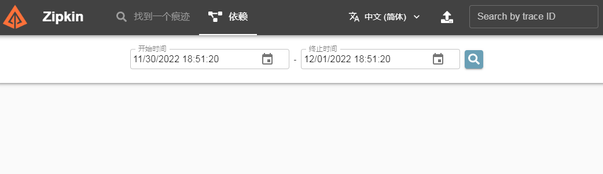
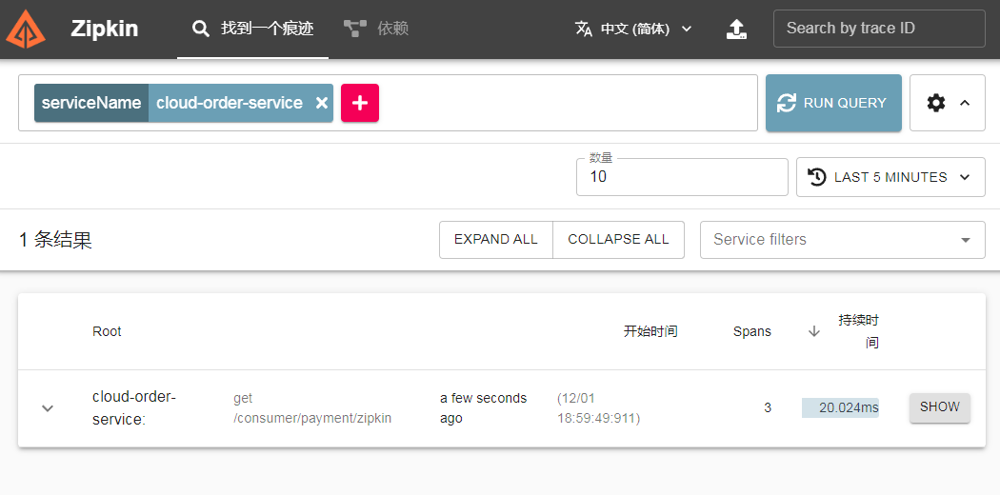
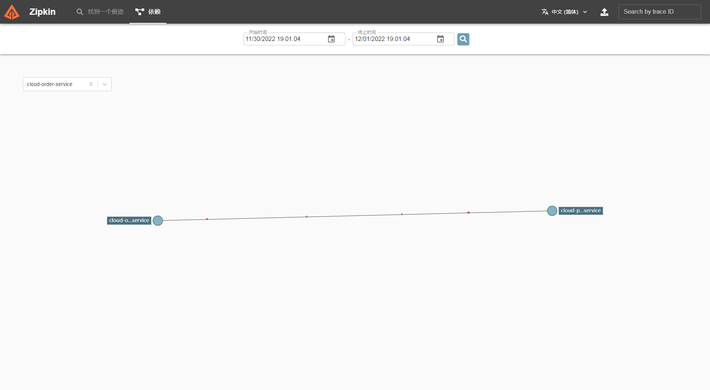

# 十六、SpringCloud Sleuth分布式请求链路追踪


https://github.com/spring-cloud/spring-cloud-sleuth

https://cloud.spring.io/spring-cloud-sleuth/reference/html/

docker 直接启动zipkin 

`docker run -d -p 9411:9411 openzipkin/zipkin`



### 服务提供者cloud-provider-payment8001

1. pom

```xml
<dependency>
    <groupId>org.springframework.cloud</groupId>
    <artifactId>spring-cloud-starter-zipkin</artifactId>
</dependency>
```

2. 在yml中添加(注意层级 application下)

   ```yml
     zipkin:
       base-url: http://10.0.41.31:9411
     sleuth:
       sampler:
         probability: 1
   ```

3. 在PaymentController中添加：

   ```java
   @GetMapping("/payment/zipkin")
   public String paymentZipkin(){
       return "payment.zipkin...";
   }
   ```


### 服务消费者cloud-consumer-order80

1. 在pom中添加（和提供者一样）

2. 在yml中添加（和提供者一样）

3. 在OrderController中添加：

   ```java
   @GetMapping("/consumer/payment/zipkin")
   public String paymentZipkin(){
       System.out.println("/consumer/payment/zipkin");
       String result = restTemplate.getForObject("http://localhost:8001"+"/payment/zipkin",String.class);
       return result;
   }
   ```

   



