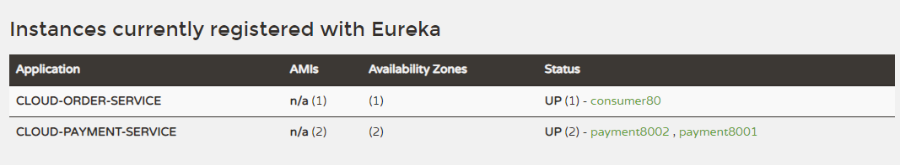

# eureka


Eureka 是 Netflix 开源的一个 RESTful (代表性状态传输) 服务，主要用于服务注册与发现。Eureka 由两个组件组成：Eureka 服务器和 Eureka 客户端。Eureka 服务器用作服务注册服务器；Eureka 客户端是一个 Java 客户端，用来简化与服务器的交互、作为轮询负载均衡器，并提供服务的故障切换支持。其主要特点如下：

- 开源
- 可靠
- 功能齐全
- 基于 Java
- Spring Cloud 集成


## eureka 的几个重要概念

### Rureka 的几个重要概念egister (服务注册)

当 Eureka 客户端向 Eureka Server 注册时，它提供自身的元数据，如 IP、port、运行状况、URL 和主页等。


### Renew (服务续约)

Eureka Client 每隔 30 秒发送一次心跳来完成续约。 Eureka Client 通过续约来告知 Eureka Server 自己仍然存在，没有任何问题。正常情况下，如果 Eureka Server 在 90 秒内没有收到 Eureka Client 的续约，那么它会将实例从其注册表中删除。 此间隔时间建议用户不要更改。


### Get Registry (获取注册表信息)

Eureka Client 从 Eureka Server 获取注册表信息，并将其缓存到本地。Eureka Client 和 Eureka Server 间支持 JSON/XML 格式进行通讯。默认压缩 JSON 格式。


### Cancel (服务下线)

Eureka Client 在程序关闭时向 Eureka 服务器发送取消请求。发送请求后，该客户端实例信息将从服务器的实例注册表中删除。


## Eureka 高可用架构


架构中主要 3 种角色：

- **Eureka Server：** 通过 Register、Get、Renew 等接口提供服务注册和发现功能
- **Application Service：** 服务提供方，把自身服务实例注册到 Eureka Server
- **Application Client：** 服务调用方，通过 Eureka Server 获取服务实例，并调用 Application Service


1. 建module

cloud-eureka-server7001

2. 改pom

server端依赖对比：

```xml
<dependencies>
        <dependency>
            <groupId>org.springframework.cloud</groupId>
            <artifactId>spring-cloud-starter-netflix-eureka-server</artifactId>
        </dependency>
        <dependency>
            <groupId>com.xiaotu.cloud</groupId>
            <artifactId>cloud-api-common</artifactId>
            <version>${project.version}</version>
        </dependency>
        <dependency>
            <groupId>org.springframework.boot</groupId>
            <artifactId>spring-boot-starter-web</artifactId>
        </dependency>
        <dependency>
            <groupId>org.springframework.boot</groupId>
            <artifactId>spring-boot-starter-actuator</artifactId>
        </dependency>
        <dependency>
            <groupId>org.springframework.boot</groupId>
            <artifactId>spring-boot-devtools</artifactId>
            <scope>runtime</scope>
            <optional>true</optional>
        </dependency>
        <dependency>
            <groupId>org.projectlombok</groupId>
            <artifactId>lombok</artifactId>
            <optional>true</optional>
        </dependency>
        <dependency>
            <groupId>org.springframework.boot</groupId>
            <artifactId>spring-boot-starter-test</artifactId>
            <scope>test</scope>
        </dependency>
```


3. 写yml
在resources目录下新建application.yml文件

```yml
server:
  port: 7001
eureka:
  instance:
    hostname: localhost
  client:
    # false表示不会向注册中心注册自己
    register-with-eureka: false
    # false表示自己端就是注册中心 职责就是维护服务实例，并不需要去检索服务
    fetch-registry: false
    service-url:
      # 设置与eurekaServer交互的地址查询服务和注册服务都需要依赖这个地址
      defaultZone: http://${eureka.instance.hostname}:${server.port}/eureka/
```


4.主类

```java
@EnableEurekaServer
@SpringBootApplication
public class EurekaMain7001 {
    public static void main(String[] args) {
        SpringApplication.run(EurekaMain7001.class,args);
    }
}
```


启动失败了。。。  注意版本号呀！！！


Boot版本恢复成2.1.x后  clean后 成功运行


1. 引入依赖

   ```xml
   <dependency>
       <groupId>org.springframework.cloud</groupId>
       <artifactId>spring-cloud-starter-netflix-eureka-client</artifactId>
       <version>2.1.3.RELEASE</version>
   </dependency>
   ```

2. yml添加配置

   ```yml
   eureka:
     client:
       register-with-eureka: true
       fetch-registry: true
       service-url:
         defaultZone: http://localhost:7001/eureka
   ```

3. 主配置类上增加 `@EnableEurekaClient`注解，表示这个项目是eureka的客户端

4. 启动项目，然后刷新页面，成功注册成注册中心


 将EurekaClient端80注册进EurekaServer成为服务消费者consumer

1. 引入依赖

   ```xml
   <dependency>
       <groupId>org.springframework.cloud</groupId>
       <artifactId>spring-cloud-starter-netflix-eureka-client</artifactId>
       <version>2.1.3.RELEASE</version>
   </dependency>
   ```

2. yml添加

   ```yml
   spring:
     application:
     	name: cloud-order-service
   eureka:
     client:
       register-with-eureka: true
       fetch-registry: true
       service-url:
         defaultZone: http://localhost:7001/eureka
   ```

   


修改host

```
127.0.0.1 eureka7001.com
127.0.0.1 eureka7002.com
127.0.0.1 eureka7003.com
```


照着7001创建相同的两个Modules,7002,7003

修改7001的yml文件

```yml
server:
  port: 7001
eureka:
  instance:
    hostname: eureka7001.com #eureka服务器的实例名称
  client:
    # false表示不会向注册中心注册自己
    register-with-eureka: false
    # false表示自己端就是注册中心 职责就是维护服务实例，并不需要去检索服务
    fetch-registry: false
    service-url:
      # 单机
      # 设置与eurekaServer交互的地址查询服务和注册服务都需要依赖这个地址
      #defaultZone: http://${eureka.instance.hostname}:${server.port}/eureka/
      defaultZone: http://eureka7002.com:7002/eureka/,http://eureka7003.com:7003/eureka/

      #defaultZone是固定写法，如果要自定义，需要按以下写法才对
#      region: eureka-server
#      availability-zone:
#        eureka-server: server1,server2
#      server-url:
#        server1: http://eureka7002.com:7002/eureka/
#        server2: http://eureka7003.com:7003/eureka/

```

同理 修改7002.7003的yml，然后启用所用项目 http://eureka7003.com:7003/


1. 按照8001新建8002（只多建了一个提供者，建多了怕电脑受不了）。（除了要yml文件中需要改端口号和主配置类，其他直接复制8001的，yml文件中的应用名不需要改，因为是集群，所以应用名需要一致）

2. 分别在所有的提供者的PaymentController中加入：（这个@Value是spring的注解）

   ```java
   @Value("${server.port}")
   private String serverPort;
   
   ...
   return new CommonResult(200,"插入数据库成功,serverPort:"+serverPort,result);
   ...
   return new CommonResult(200,"查询成功,serverPort:"+serverPort,payment);
   
   ```

   

3. 修改消费者的OrderController，把写死的url改为服务名称：

   ```java
    private static final String PAYMENT_URL= "http://CLOUD-PAYMENT-SERVICE"; //注意名字需要为服务名！！！
   ```

   

4. 然后在消费者的ApplicationContextConfig里的restTemplate方法上加上`@LoadBalanced`，开启负载均衡功能。
5. 启动eurekaServer集群，启动提供者集群，启动消费者。
   如果启动提供者后出现，这个错误：Public Key Retrieval is not allowed
   请在yml文件中的datasource.datasource.url后加上&allowPublicKeyRetrieval=true即可解决。

多请求几次


## actuator 微服务信息完善

修改三个微服务的yml文件：

```yml
###8001
eureka:
  instance:
    instance-id: payment8001
    prefer-ip-address: true

###8002
eureka:
  instance:
    instance-id: payment8002
    prefer-ip-address: true

###80
eureka:
  instance:
    instance-id: consumer80
    prefer-ip-address: true
```


原：


现：




## 服务发现Discovery

对于注册进eureka里面的微服务，可以通过服务发现来获得该服务的信息。

 修改提供者集群的controller  服务提供者 既payment

1. 在主配置类上加上`@EnableDiscoveryClient`注解，启用发现客户端。
2. 在两个提供者的PaymentController中加入：

```java
    //Springframework的DiscoveryClient
    @Resource
    private DiscoveryClient discoveryClient;

    @GetMapping("/payment/discovery")
    public Object discovery(){
        //获取服务列表信息
        List<String> services = discoveryClient.getServices();
        for (String element:services){
            log.info("********element:"+element);
        }

        //获取CLOUD-PAYMENT-SERVICE服务的具体实例
        List<ServiceInstance> instances = discoveryClient.getInstances("CLOUD-PAYMENT-SERVICE");
        for (ServiceInstance instance : instances
        ) {
            log.info(instance.getInstanceId()+"\t"+instance.getHost()+"\t"+instance.getPort()+"\t"+instance.getClass());
        }

        return discoveryClient;
    }

```


测试

重启8001和8002，输入http://localhost:8001/payment/discovery


## Eureka自我保护

保护模式主要用于一组客户端和Eureka Server之间存在网络分区场景下的保护，一旦进入保护模式。Eureka Server将会尝试保护其服务注册表中的信息，不再删除服务注册表中的数据，也就是不会注销任何微服务。

如何在Eureka Server的首要看到下面这个提示 说明Eureka进入了保护模式。

EMERGENCY! EUREKA MAY BE INCORRECTLY CLAIMING INSTANCES ARE UP WHEN THEY'RE NOT. RENEWALS ARE LESSER THAN THRESHOLD AND HENCE THE INSTANCES ARE NOT BEING EXPIRED JUST TO BE SAFE.


导致原因：

- 某个时刻某个微服务不可用用了，Eureka不会立即清除，依旧会对该微服务的信息进行保存
- CAP的AP分支

为什么会产生Eureka自我保护机制

为了防止EurekaClient可以正常运行，但是与EurekaServer网络不通情况下，EurekaServer不会立即将EurekaClient服务剔除

什么是自我保护模式

默认情况下，如果EurekaServer在一定时间内没有接收到某个微服务实例的心跳，EurekaServer会注销该实例（默认90秒）。但是当网络分区故障发生（延时，卡顿，拥挤）时，微服务和EurekaServer之间没办法正常通信，以上行为会变得非常危险，因为服务本身是健康的，此时不应该注销这个微服务。Eureka通过“自我保护机制”来解决这个问题。 当EurekaServer节点在短时间内丢失过多的服务端（可能发生了网络分区故障），那么这个节点会进入自我保护模式。


自我保护机制： 默认情况下EurekaClient 定时向 EurekaServer发送心跳包，如果Eureka在server端在一定时间内（默认90秒）没有收到EurekaClient发送心跳包，便会直接从注册列表中剔除该服务，但是在短时间内（90秒中）丢失了大量的服务实例心跳，这个时候Eureka会开启自我保护机制，即不会剔除服务。（该现象可能出现在如果网络不通，但是EurekaClient出现宕机，此时如果换做别的注册中心如果一定时间内没有收到心跳，可能剔除该服务，这样就会出现严重失误，因为客户端还能发送心跳，只是网络延迟问题，自我保护机制为了解决此问题）


#### 禁止自我保护

先把cloud-eureka-server7001和cloud-provider-payment8001都切回单机版测试禁止自我保护。

cloud-eureka-server7001的yml文件：

```yml
#  server:
#    enable-self-preservation: true #关闭自我保护
#    eviction-interval-timer-in-ms: 2000 #心跳间隔
```

cloud-provider-payment8001的yml文件：

```yml
#    lease-renewal-interval-in-seconds: 1 #续租时间 默认30秒 单位秒
#    lease-expiration-duration-in-seconds: 2 #收到最后一次心跳后等待时间上限 默认90秒 单位秒 超时剔除服务
```


