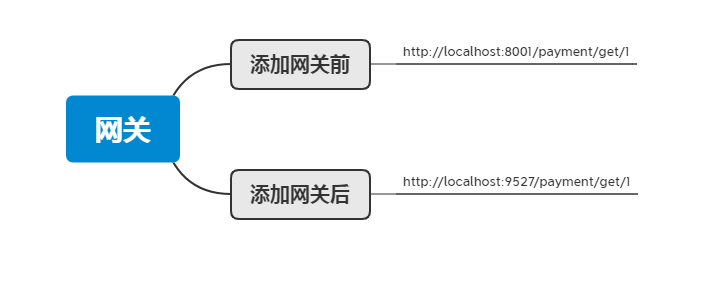
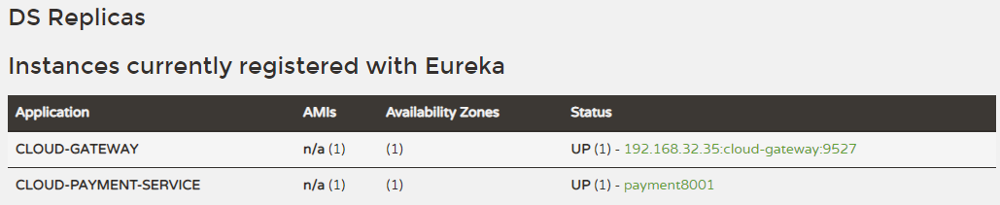
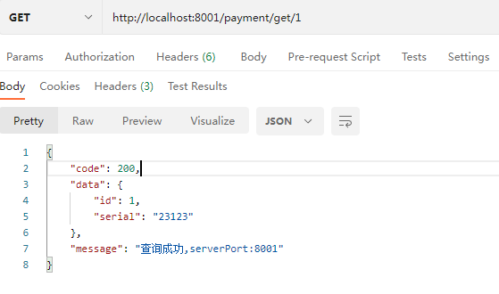
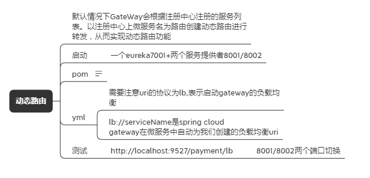
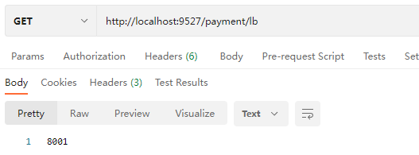
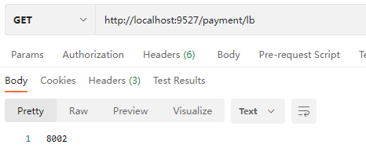

# Gateway新一代网关

https://cloud.spring.io/spring-cloud-static/spring-cloud-gateway/2.2.1.RELEASE/reference/html/


1. 新建模块cloud-gateway-gateway9527

2. pom

   ```xml
    <dependencies>
           <!--gateway-->
           <dependency>
               <groupId>org.springframework.cloud</groupId>
               <artifactId>spring-cloud-starter-gateway</artifactId>
           </dependency>
           <!--通用组件-->
           <dependency>
               <groupId>com.xiaotu.cloud</groupId>
               <artifactId>cloud-api-common</artifactId>
               <version>${project.version}</version>
           </dependency>
           <!--eureka client 通过微服务实现动态路由-->
           <dependency>
               <groupId>org.springframework.cloud</groupId>
               <artifactId>spring-cloud-starter-netflix-eureka-client</artifactId>
           </dependency>
           <dependency>
               <groupId>org.springframework.boot</groupId>
               <artifactId>spring-boot-devtools</artifactId>
               <scope>runtime</scope>
               <optional>true</optional>
           </dependency>
           <dependency>
               <groupId>org.springframework.boot</groupId>
               <artifactId>spring-boot-test</artifactId>
           </dependency>
       </dependencies>
   ```

3. yml

   ```yml
   server:
     port: 9527
   spring:
     application:
       name: cloud-gateway
   eureka:
     instance:
       hostname: cloud-gateway-service
     client:
       register-with-eureka: true
       fetch-registry: true
       service-url: http://localhost:7001/eureka/
   ```

4. 配置主类

   ```java
   @EnableEurekaClient
   @SpringBootApplication
   public class GatewayMain9527 {
       public static void main(String[] args) {
           SpringApplication.run(GatewayMain9527.class,args);
       }
   }
   ```

5. 修改yml文件

   

   ```yml
   spring:
     application:
       name: cloud-gateway
     cloud:
       gateway:
         routes:
           - id: payment_route #路由的id,没有规定单要求唯一，建议配合服务名
             # 匹配后提供服务的路由地址
             uri: http://localhost:8001
             predicates:
               - Path=/payment/get/** #断言 路径相匹配的进行路由
           - id: payment_route2 #路由的id,没有规定单要求唯一，建议配合服务名
             # 匹配后提供服务的路由地址
             uri: http://localhost:8001
             predicates:
               - Path=/payment/lb/** #断言 路径相匹配的进行路由
   ```

6. 测试，启动7001,cloud-provider-payment-8001,9527

   

   

   


### Gateway网关路由的两种配置方式

1. 在配置文件中配置
   在配置文件yml中配置

2. 在配置类中配置
   代码中注入RouteLocator的Bean

   

   新建config.GatewayConfig

   ```java
   @Configuration
   public class GatewayConfig {
   
       @Bean
       public RouteLocator customRouteLocator(RouteLocatorBuilder routeLocatorBuilder) {
           RouteLocatorBuilder.Builder routes = routeLocatorBuilder.routes();
   
           routes.route("path_route_xiaotu",  //id
                   r-> r.path("/guonei") //访问 http://localhost:9527/guonei
                   .uri("http://news.baidu.com/guonei"));
           routes.route("path_route",  //id
                   r-> r.path("/guoji") //访问 http://localhost:9527/guoji
                           .uri("http://news.baidu.com/guoji"));
           return routes.build();
       }
   
   }
   ```

   测试，启动7001，8001，9527

   

   ## 通过微服务名实现动态路由

   

   

   修改yml文件：

   ```yml
   spring:
     application:
       name: cloud-gateway
     cloud:
       gateway:
         discovery:
           locator:
             enabled: true #开启后动态从注册中心,利用微服务名称进行路由，默认false
         routes:
           - id: payment_route #路由的id,没有规定单要求唯一，建议配合服务名
             # 匹配后提供服务的路由地址
             # uri: http://localhost:8001
             uri: lb://cloud-payment-service
             predicates:
               - Path=/payment/get/** #断言 路径相匹配的进行路由
           - id: payment_route2 #路由的id,没有规定单要求唯一，建议配合服务名
             # 匹配后提供服务的路由地址
             # uri: http://localhost:8001
             uri: lb://cloud-payment-service
             predicates:
               - Path=/payment/lb/** #断言 路径相匹配的进行路由
   
   ```

   

   测试，启动7001，8001，8002，9527
   `http://localhost:9527/payment/lb`






## Predicate的使用

官网：https://cloud.spring.io/spring-cloud-static/spring-cloud-gateway/2.2.1.RELEASE/reference/html/#gateway-request-predicates-factories


Spring Cloud Gateway将路由匹配作为