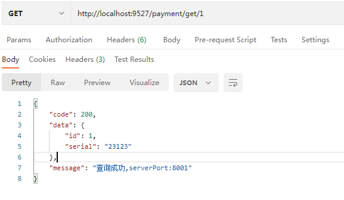
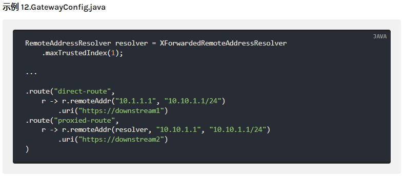
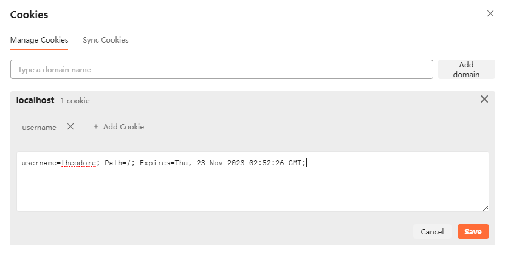
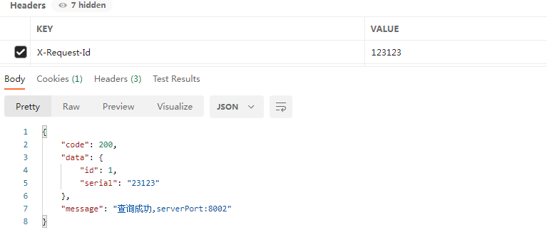
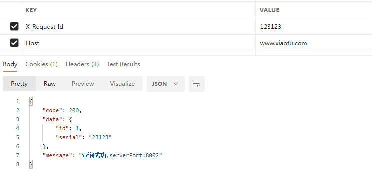
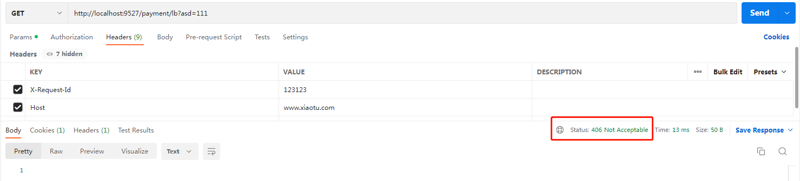
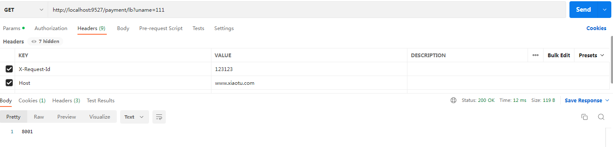

# Gateway新一代网关

https://cloud.spring.io/spring-cloud-static/spring-cloud-gateway/2.2.1.RELEASE/reference/html/


1. 新建模块cloud-gateway-gateway9527

2. pom

   ```xml
    <dependencies>
           <!--gateway-->
           <dependency>
               <groupId>org.springframework.cloud</groupId>
               <artifactId>spring-cloud-starter-gateway</artifactId>
           </dependency>
           <!--通用组件-->
           <dependency>
               <groupId>com.xiaotu.cloud</groupId>
               <artifactId>cloud-api-common</artifactId>
               <version>${project.version}</version>
           </dependency>
           <!--eureka client 通过微服务实现动态路由-->
           <dependency>
               <groupId>org.springframework.cloud</groupId>
               <artifactId>spring-cloud-starter-netflix-eureka-client</artifactId>
           </dependency>
           <dependency>
               <groupId>org.springframework.boot</groupId>
               <artifactId>spring-boot-devtools</artifactId>
               <scope>runtime</scope>
               <optional>true</optional>
           </dependency>
           <dependency>
               <groupId>org.springframework.boot</groupId>
               <artifactId>spring-boot-test</artifactId>
           </dependency>
       </dependencies>
   ```

3. yml

   ```yml
   server:
     port: 9527
   spring:
     application:
       name: cloud-gateway
   eureka:
     instance:
       hostname: cloud-gateway-service
     client:
       register-with-eureka: true
       fetch-registry: true
       service-url: http://localhost:7001/eureka/
   ```

4. 配置主类

   ```java
   @EnableEurekaClient
   @SpringBootApplication
   public class GatewayMain9527 {
       public static void main(String[] args) {
           SpringApplication.run(GatewayMain9527.class,args);
       }
   }
   ```

5. 修改yml文件

   

   ```yml
   spring:
     application:
       name: cloud-gateway
     cloud:
       gateway:
         routes:
           - id: payment_route #路由的id,没有规定单要求唯一，建议配合服务名
             # 匹配后提供服务的路由地址
             uri: http://localhost:8001
             predicates:
               - Path=/payment/get/** #断言 路径相匹配的进行路由
           - id: payment_route2 #路由的id,没有规定单要求唯一，建议配合服务名
             # 匹配后提供服务的路由地址
             uri: http://localhost:8001
             predicates:
               - Path=/payment/lb/** #断言 路径相匹配的进行路由
   ```

6. 测试，启动7001,cloud-provider-payment-8001,9527

   

   

   


## Gateway网关路由的两种配置方式

1. 在配置文件中配置
   在配置文件yml中配置

2. 在配置类中配置
   代码中注入RouteLocator的Bean

   

   新建config.GatewayConfig

   ```java
   @Configuration
   public class GatewayConfig {
   
       @Bean
       public RouteLocator customRouteLocator(RouteLocatorBuilder routeLocatorBuilder) {
           RouteLocatorBuilder.Builder routes = routeLocatorBuilder.routes();
   
           routes.route("path_route_xiaotu",  //id
                   r-> r.path("/guonei") //访问 http://localhost:9527/guonei
                   .uri("http://news.baidu.com/guonei"));
           routes.route("path_route",  //id
                   r-> r.path("/guoji") //访问 http://localhost:9527/guoji
                           .uri("http://news.baidu.com/guoji"));
           return routes.build();
       }
   
   }
   ```

   测试，启动7001，8001，9527

   

   ### 通过微服务名实现动态路由

   

   

   修改yml文件：

   ```yml
   spring:
     application:
       name: cloud-gateway
     cloud:
       gateway:
         discovery:
           locator:
             enabled: true #开启后动态从注册中心,利用微服务名称进行路由，默认false
         routes:
           - id: payment_route #路由的id,没有规定单要求唯一，建议配合服务名
             # 匹配后提供服务的路由地址
             # uri: http://localhost:8001
             uri: lb://cloud-payment-service
             predicates:
               - Path=/payment/get/** #断言 路径相匹配的进行路由
           - id: payment_route2 #路由的id,没有规定单要求唯一，建议配合服务名
             # 匹配后提供服务的路由地址
             # uri: http://localhost:8001
             uri: lb://cloud-payment-service
             predicates:
               - Path=/payment/lb/** #断言 路径相匹配的进行路由
   
   ```

   

   测试，启动7001，8001，8002，9527
   `http://localhost:9527/payment/lb`


## Predicate的使用

官网：https://cloud.spring.io/spring-cloud-static/spring-cloud-gateway/2.2.1.RELEASE/reference/html/#gateway-request-predicates-factories


### After/Before/Between

新建测试类T2

```java
import java.time.ZonedDateTime;
public class T2 {

    public static void main(String[] args) {
        //获取当前时间串
        ZonedDateTime now = ZonedDateTime.now();
        System.out.println(now);
        //2022-11-23T10:38:31.766+08:00[Asia/Singapore]
    }
}
```

配置yml,增加1小时

```yml
          predicates:
            - Path=/payment/get/** #断言 路径相匹配的进行路由
            - After=2022-11-23T11:38:31.766+08:00[Asia/Singapore] #增加一小时
```

测试： 配置after谓语的路由暂时没办法访问( 需等一小时后)，其他路由正常。

### Cookies

配置yml( cookie 名称和正则表达式 )

```yml
- Cookie=username,theodore
```

postman右上角添加cookies



或者直接curl吧

### Header

配置yml( header 名称和正则表达式 )

```yaml
- Header=X-Request-Id, \d+
```



### Host

主机名模式列表。该模式是 Ant 风格的模式，带有`.`分隔符

```yml
# 1.Ant xxx.xiaotu.com
- Host=**.xiaotu.com,**.anotherhost.org
# 2.URI模板变量，ServerWebExchange.getAttributes()具有定义在中的键中
- Host={sub}.xiaotu.com
```




### Method

请求方法

```yml
- Method=POST
```


### Path

请求路径

```yml
- Path=/red/{segment},/blue/{segment}
```


```java
Map<String, String> uriVariables = ServerWebExchangeUtils.getPathPredicateVariables(exchange);

String segment = uriVariables.get("segment");
```

### Query

请求参数

一个必需`param`的和一个可选的`regexp`

```yml
- Query=name,\d+
```


## Filter的使用

https://cloud.spring.io/spring-cloud-static/spring-cloud-gateway/2.2.1.RELEASE/reference/html/#the-addrequestheader-gatewayfilter-factory

路由过滤器允许以某种方式修改传入的 HTTP 请求或传出的 HTTP 响应

GatewayFilter（31种）
Global Filter（10种)

新增过滤器 filter.MyLogGateWayFilter

```java
@Component
@Slf4j
public class MyLogGateWayFilter implements GlobalFilter, Ordered {

    @Override
    public Mono<Void> filter(ServerWebExchange exchange, GatewayFilterChain chain) {
        log.info("*************come in MyLogGateWayFilter: "+ new Date());
        //获取request中的uname参数
        String uname = exchange.getRequest().getQueryParams().getFirst("uname");
        if (uname == null) {
            log.info("*************用户名为null，非法用户");
            exchange.getResponse().setStatusCode(HttpStatus.NOT_ACCEPTABLE);
            return exchange.getResponse().setComplete();
        }
        //放行
        return chain.filter(exchange);
    }

    @Override
    public int getOrder() {
        //返回优先级
        return 0;
    }
}
```


http://localhost:9527/payment/lb?asd=111



http://localhost:9527/payment/lb?uname=111

