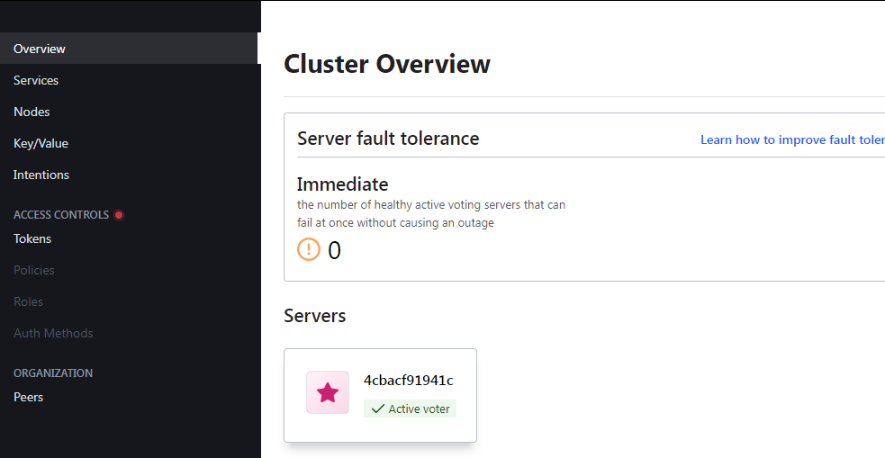
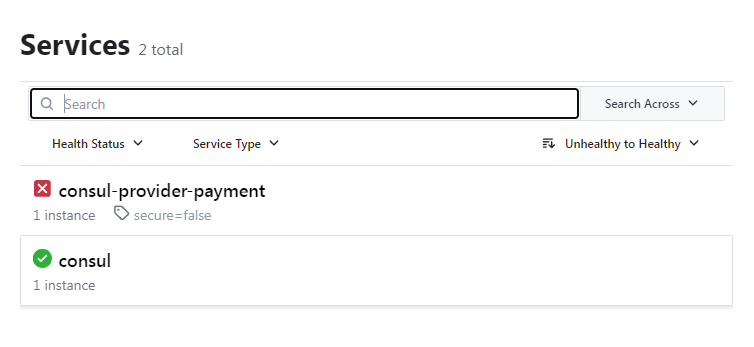
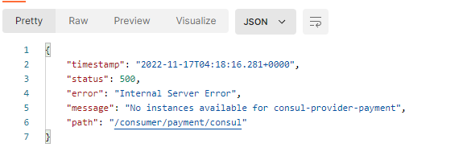
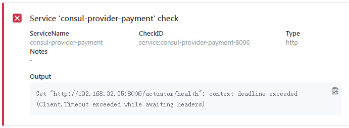
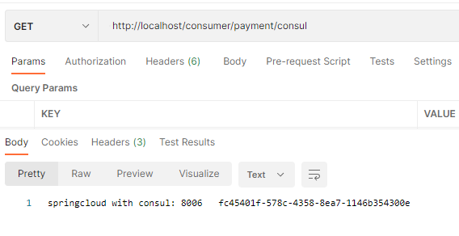

# Consul 服务注册和发现

Consul官网：https://www.consul.io/
Consul中文文档：https://www.springcloud.cc/spring-cloud-consul.html

简介
Consul是一种服务网格解决方案，提供具有服务发现，配置和分段功能的全功能控制平面。这些功能中的每一个都可以根据需要单独使用，也可以一起使用以构建完整的服务网格。Consul需要一个数据平面，并支持代理和本机集成模型。Consul附带了一个简单的内置代理，因此一切都可以直接使用，还支持Envoy等第三方代理集成。


主要特点
服务发现：Consul的客户端可以注册服务，例如 api或mysql，其他客户端可以使用Consul来发现给定服务的提供者。使用DNS或HTTP，应用程序可以轻松找到它们依赖的服务。

健康检测：领事客户端可以提供任意数量的运行状况检查，这些检查可以与给定服务（“ Web服务器是否返回200 OK”）或本地节点（“内存利用率低于90％”）相关。操作员可以使用此信息来监视群集的运行状况，服务发现组件可以使用此信息将流量从不正常的主机发送出去。

KV存储：应用程序可以将Consul的分层键/值存储用于多种目的，包括动态配置，功能标记，协调，领导者选举等。简单的HTTP API使其易于使用。

安全的服务通信：领事可以为服务生成并分发TLS证书，以建立相互TLS连接。 意图 可用于定义允许哪些服务进行通信。可以使用可以实时更改的意图轻松管理服务分段，而不必使用复杂的网络拓扑和静态防火墙规则。

多数据中心：Consul开箱即用地支持多个数据中心。这意味着Consul的用户不必担心会构建其他抽象层以扩展到多个区域。

Consul旨在对DevOps社区和应用程序开发人员友好，使其非常适合现代，灵活的基础架构


在docker上安装启动consul

```sh
docker pull consul

docker run -d -p 8500:8500/tcp -name myConsul consul
```


浏览器输入http://10.0.41.31:8500 



服务提供者

1. 新建module cloud-provider-consul-payment8006

2. pom复制8004

   ```xml
   <dependency>
       <groupId>org.springframework.cloud</groupId>
       <artifactId>spring-cloud-starter-consul-discovery</artifactId>
   </dependency>
   ```

3. yml

   ```yml
   server:
     port: 8006
   
   spring:
     application:
       name: consul-provider-payment
     cloud:
       consul:
         host: 10.0.41.31
         port: 8500
         discovery:
           service-name: ${spring.application.name}
   ```

4. 主启动类

5. controller

   ```java
   @Slf4j
   @RestController
   public class PaymentController {
   
       @Value("${server.port}")
       private String serverPort;
   
       @RequestMapping("/payment/consul")
       public String paymentConsul(){
           return "springcloud with consul: "+ serverPort + "\t" + UUID.randomUUID().toString();
       }
   
   }
   ```

6. 启用项目（没接心跳 所有爆红 暂时不用管  接口正常就行）



 	输入http://localhost:8006/payment/consul


检查服务


请求 http://localhost/consumer/payment/consul



应该是服务发现 未正常检查到心跳的问题。检查发现



修改pom文件，导入common包（包含actuator依赖），重启项目。

还是失败，地址本地请求成功，发现内网虚拟机ping不到本机，换了台服务启consul.

还是不行。。。 增加心跳配置 后终于正常（默认应该开启的呀 挖个坑在这）

```yml
discovery:
	heartbeat:
		enable: true
```


