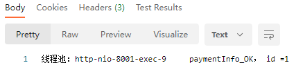
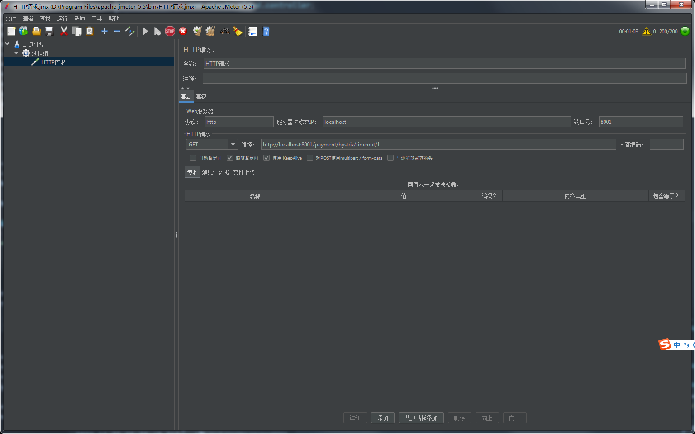
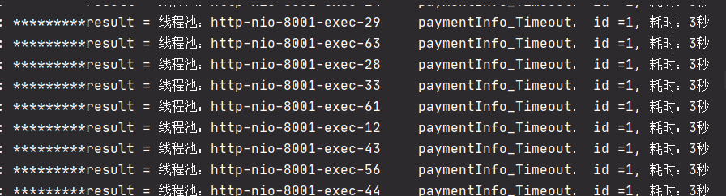
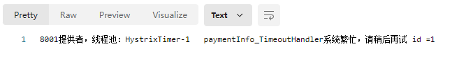
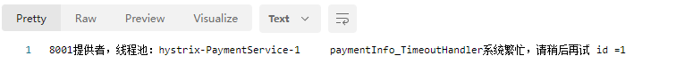
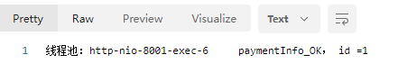
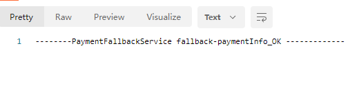

# Hystrix断路器

分布式系统面临问题

复杂分布式体系结构中的应用程序有数十个依赖关系，每个依赖关系在某些时刻不可避免的丢失。

服务雪崩：

多个微服务之间的调用，假设微服务A调用微服务B和C,微服务B和C又调用其他的微服务，这就是所谓的“扇出”。如果扇出的链路上某个微服务的调用时间时间过长或者不可用，对于微服务A的调用会占用越来越多的系统资源，进而引起系统崩溃，所谓的雪崩效应。

“断路器”本身是一种开关装置。当某个服务单元发生故障之后，通过断路器的故障监控（熔断保险丝）。向调用方返回一个符合预期的，可处理的备选响应（Fellback），而不是长时间的等待或者抛出调用方无法处理的异常。这样就保证了服务调用方的线程不会被长时间的、不必要的占用，从而避免故障在分布式系统中的蔓延，乃至雪崩。

Hystrix重要概念

服务降级（fallback）

提供者和消费者都可以进行服务降级

服务忙，请稍后再试，不让客户端等待并立即返回一个友好提示

- 程序运行异常
- 超时
- 服务熔断触发服务降级
- 线程池/信号量打满也会导致服务降级

服务熔断（break）

类似保险丝达到最大的服务访问后，直接拒绝访问，拉闸限电，然后调用服务降级的方式返回友好提示。

服务限流（flowlimit）

秒杀高并发等操作。严禁一窝蜂过来拥挤，大家排队，一秒钟N个，有序进行。


## Hystrix案例

1. 新建项目 cloud-provider-hystrix-payment8001

2. pom

   ```xml
     <dependencies>
           <dependency>
               <groupId>org.springframework.cloud</groupId>
               <artifactId>spring-cloud-starter-netflix-hystrix</artifactId>
           </dependency>
           <dependency>
               <groupId>com.xiaotu.cloud</groupId>
               <artifactId>cloud-api-common</artifactId>
               <version>${project.version}</version>
           </dependency>
           <dependency>
               <groupId>org.springframework.boot</groupId>
               <artifactId>spring-boot-starter-web</artifactId>
           </dependency>
           <dependency>
               <groupId>org.springframework.boot</groupId>
               <artifactId>spring-boot-starter-actuator</artifactId>
           </dependency>
           <dependency>
               <groupId>org.springframework.cloud</groupId>
               <artifactId>spring-cloud-starter-netflix-eureka-client</artifactId>
           </dependency>
   
           <dependency>
               <groupId>org.springframework.boot</groupId>
               <artifactId>spring-boot-devtools</artifactId>
               <scope>runtime</scope>
               <optional>true</optional>
           </dependency>
           <dependency>
               <groupId>org.springframework.boot</groupId>
               <artifactId>spring-boot-starter-test</artifactId>
           </dependency>
       </dependencies>
   ```

3. yml

   ```yml
   server:
     port: 8001
   spring:
     application:
       name: cloud-provider-hystrix-payment
   
   eureka:
     client:
       register-with-eureka: true
       fetch-registry: true
       service-url:
         #单机版
         defaultZone: http://localhost:7001/eureka
         #集群版
         #defaultZone: http://eureka7001.com:7001/eureka/,http://eureka7002.com:7002/eureka/,http://eureka7003.com:7003/eureka
   
   ```

4. 主启动类

   ```java
   @EnableEurekaClient
   @SpringBootApplication
   public class PaymentHystrixMain8001 {
       public static void main(String[] args) {
           SpringApplication.run(PaymentHystrixMain8001.class,args);
       }
   }
   ```

5. service

   ```java
   @Service
   public class PaymentService {
   
       //正常访问方法
       public String paymentInfo_OK(Integer id){
           return "线程池：" + Thread.currentThread().getName() + "\t paymentInfo_OK， id ="+ id;
       }
   
       public String paymentInfo_Timeout(Integer id){
           int timeNumber = 3;
           try {
               TimeUnit.SECONDS.sleep(timeNumber);
           }catch (InterruptedException e){
               e.printStackTrace();
           }
           return  "线程池：" + Thread.currentThread().getName() + "\t paymentInfo_Timeout， id ="+ id + ", 耗时："+timeNumber+"秒";
       }
   }
   ```

6. controller

   ```java
   @Slf4j
   @RestController
   public class PaymentController {
   
       @Resource
       PaymentService paymentService;
   
       @Value("${server.port}")
       private String serverPort;
   
       @GetMapping("/payment/hystrix/ok/{id}")
       public String paymentInfo_OK(@PathVariable("id") Integer id){
           String result = paymentService.paymentInfo_OK(id);
           log.info("*********result = " + result);
           return result;
       }
   
       @GetMapping("/payment/hystrix/timeout/{id}")
       public String paymentInfo_Timeout(@PathVariable("id") Integer id){
           String result = paymentService.paymentInfo_Timeout(id);
           log.info("*********result = " + result);
           return result;
       }
   
   }
   ```

7. 启动7001和8001

   http://localhost:8001/payment/hystrix/ok/1

   

   http://localhost:8001/payment/hystrix/timeout/1

   


#### 高并发测试

下载jmeter 进行压测

https://jmeter.apache.org/download_jmeter.cgi





可以发现线程打满，自己再去访问，速度明显变慢


新建80

1. 新建cloud-consumer-feign-hystrix-order80

2. pom

   ```xml
       <dependencies>
           <dependency>
               <groupId>org.springframework.cloud</groupId>
               <artifactId>spring-cloud-starter-openfeign</artifactId>
           </dependency>
           <dependency>
               <groupId>org.springframework.cloud</groupId>
               <artifactId>spring-cloud-starter-netflix-hystrix</artifactId>
           </dependency>
           <dependency>
               <groupId>org.springframework.cloud</groupId>
               <artifactId>spring-cloud-starter-netflix-eureka-client</artifactId>
           </dependency>
           <dependency>
               <groupId>com.xiaotu.cloud</groupId>
               <artifactId>cloud-api-common</artifactId>
               <version>${project.version}</version>
           </dependency>
           <dependency>
               <groupId>org.springframework.boot</groupId>
               <artifactId>spring-boot-starter-web</artifactId>
           </dependency>
           <dependency>
               <groupId>org.springframework.boot</groupId>
               <artifactId>spring-boot-starter-actuator</artifactId>
           </dependency>
           <dependency>
               <groupId>org.springframework.boot</groupId>
               <artifactId>spring-boot-devtools</artifactId>
               <scope>runtime</scope>
               <optional>true</optional>
           </dependency>
           <dependency>
               <groupId>org.springframework.boot</groupId>
               <artifactId>spring-boot-starter-test</artifactId>
               <scope>test</scope>
           </dependency>
   
       </dependencies>
   ```

3. yml

   ```yml
   server:
     port: 80
   eureka:
     client:
       register-with-eureka: false
       service-url:
         defaultZone: http://localhost:7001/eureka
   ribbon:
     ReadTimeout: 4000
     ConnectTimeout: 4000
   ```

4. 主启动类

   ```java
   @EnableEurekaClient
   @EnableFeignClients
   @SpringBootApplication
   public class OrderHystrixMain80 {
       public static void main(String[] args) {
           SpringApplication.run(OrderHystrixMain80.class,args);
       }
   }
   ```

5. service

   ```java
   @Component
   @FeignClient(value = "CLOUD-PROVIDER-HYSTRIX-SERVICE")
   public interface PaymentHystrixService {
   
       @GetMapping("/payment/hystrix/ok/{id}")
       public String paymentInfo_OK(@PathVariable("id") Integer id);
   
   
       @GetMapping("/payment/hystrix/timeout/{id}")
       public String paymentInfo_Timeout(@PathVariable("id") Integer id);
   
   }
   ```

6. controller

   ```java
   @Slf4j
   @RestController
   public class OrderHystrixController {
   
       @Resource
       private PaymentHystrixService paymentHystrixService;
   
       @GetMapping("/consumer/payment/hystrix/ok/{id}")
       public String paymentInfo_OK(@PathVariable("id") Integer id){
           String result = paymentHystrixService.paymentInfo_OK(id);
           return result;
       }
   
       @GetMapping("/consumer/payment/hystrix/timeout/{id}")
       public String paymentInfo_Timeout(@PathVariable("id") Integer id){
           String result = paymentHystrixService.paymentInfo_Timeout(id);
           return result;
       }
   
   }
   ```

7. 启动80，进行测试

   http://localhost/consumer/payment/hystrix/ok/1

   

   

   http://localhost/consumer/payment/hystrix/timeout/1

   

   

8. 启动jmeter，然后再进行测试

   高并发测试

   - 2w个线程压8001
   - 消费端80微服务再去访问正常的OK微服务的80001地址
   - http://localhost/consumer/payment/hystrix/ok/32
   - 消费者80
     - 转圈等待
     - 超时报错

   

#### 故障现象、导致原因以及解决

现象：

8001同一层次的其他接口服务被困死，因为tomcat线程池里面的工作线程已被挤占完毕。80此时调用8001，客户端访问慢吗，转圈。

解决：

1.超时导致服务器变慢=》 超时不再等待

2.出错=》兜底逻辑

对方服务（8001）超时了，调用方（80）不能一直卡死等待，必须要有服务降级

对方服务（8001）down机了，调用方（80）不能一直卡死等待，必须要有服务降级

对方服务（8001）OK，调用方（80）自身故障或自我要求（等待时间小于服务提供者），自己处理降级


#### 提供者

1. 修改8001中PaymentService的paymentInfo_TimeOut方法，并添加paymentInfo_TimeOutHandler方法：

   ```java
       @HystrixCommand(fallbackMethod = "paymentInfo_TimeoutHandler",commandProperties = {
               //设置自身超时调用时间的峰值为3秒，峰值内可以正常运行，超过了需要有兜底逻辑，服务降级fallback
               @HystrixProperty(name = "execution.isolation.thread.timeoutInMilliseconds",value = "3000")
       })
       public String paymentInfo_Timeout(Integer id){
           int timeNumber = 5;
           try {
               TimeUnit.SECONDS.sleep(timeNumber);
           }catch (InterruptedException e){
               e.printStackTrace();
           }
           return  "线程池：" + Thread.currentThread().getName() + "\t paymentInfo_Timeout， id ="+ id + ", 耗时："+timeNumber+"秒";
       }
   
       public String paymentInfo_TimeoutHandler(Integer id){
           return  "8001提供者，线程池：" + Thread.currentThread().getName() +
                   "\t paymentInfo_TimeoutHandler系统繁忙，请稍后再试 id ="+ id;
       }
   ```

2. 然后在8001的主启动类上添加`@EnableCircuitBreaker`注解，启用断路器。

3. 启动7001和8001，测试8001的fallback，`http://localhost:8001/payment/hystrix/timeout/1`成功进入fallback方法。（并且fallback方法是用Hystrix的线程池）

   

4. 去掉sleep，改为 1 / 0，测试方法运行异常

   


### 消费者

1. yml

   ```yml
   feign:
     hystrix:
       enabled: true
   ```

2. 在主启动类添加@EnableHystrix注解

3. 修改OrderHystrixController的paymentInfo_Timeout方法，并添加PaymentTimeoutFallbackMethod方法：

   ```java
       @HystrixCommand(fallbackMethod = "paymentTimeoutFallbackMethod",commandProperties = {
           @HystrixProperty(name = "execution.isolation.thread.timeoutInMilliseconds",value = "1500")
       })
       @GetMapping("/consumer/payment/hystrix/timeout/{id}")
       public String paymentInfo_Timeout(@PathVariable("id") Integer id){
           String result = paymentHystrixService.paymentInfo_Timeout(id);
           return result;
       }
   
       public String paymentTimeoutFallbackMethod(@PathVariable("id") Integer id){
           return "消费者80，支付系统繁忙";
       }
   ```

4. 启动7001，8001，80，`http://localhost/consumer/payment/hystrix/timeout/1`（如果是提供者那边出问题，并且消费者设置了fallback，会优先进入消费者的fallback）

   

   

   添加`int i = 1 / 0;`，运行异常也会进入80的fallback方法。

   

   

   

   

   #### 目前的问题和解决办法

   问题： 每个方法对应一个兜底方法，代码膨胀

   解决问题： 每个方法配置一个    膨胀

   ​					和业务逻辑混在一起  混乱

   解决方法：设置全局fallback方法，特殊的重要方法设置自己的独立fallback

​	

1. 在80的OrderHystrixController中添加全局fallback方法：

   ```java
      //全局异常处理 不能有传参
       public String payment_Global_FallbackMethod(){
           return "Global异常处理信息，请稍后再试";
       }
   ```

   

2. 并在OrderHystrixController类上加上`@DefaultProperties(defaultFallback = "payment_Global_FallbackMethod")`，设置全局fallback方法。

3. 把paymentInfo_TimeOut方法上添加@HystrixCommand

4. 进行测试，`http://localhost/consumer/payment/hystrix/timeout2/1`

   


模拟宕机场景

1. 在80的service包下新建PaymentFallbackService类，实现PaymentHystrixService接口

2. yml无需处理，已有配置类

3. 然后给PaymentHystrixService接口的@FeignClient注解加上`fallback = PaymentFallbackService.class`属性，用于出错进行fallback处理

4. 启动7001,8001,80访问http://localhost/consumer/payment/hystrix/ok/1

   

   关闭8001再次访问

   


服务熔断

熔断机制是对应雪崩效应的一种微服务链路保护机制。当扇出链路的某个微服务出错不可用或者响应时间太长时，会进行服务降级，进而熔断该节点微服务的调用，快速返回错误的响应信息。

在SpringCloud中，熔断机制由Hystrix实现，Hystrix会监控微服务间的调用状况。

当失败的调用到一定阈值，缺省是5秒中20次调用失败，就会启动熔断机制。

1. 在8001的PaymentService中添加

   ```java
       @HystrixCommand(
               fallbackMethod = "paymentCircuitBreaker_fallback",commandProperties = {
                       @HystrixProperty(name = "circuitBreaker.enabled",value="true"),//开启熔断器
                       @HystrixProperty(name = "circuitBreaker.requestVolumeThreshold",value="10"),//请求总数阈值
                       @HystrixProperty(name = "circuitBreaker.sleepWindowInMilliseconds",value="1000"),//休眠时间窗口期（休眠多久进入半开模式，单位毫秒，默认5秒）
                       @HystrixProperty(name = "circuitBreaker.errorThresholdPercentage",value="60"),//请求错误率到达多少跳闸（百分比%，默认50%）
       })
    public String paymentCircuitBreaker(@PathVariable("id") Integer id){
           if (id < 0){
               throw new RuntimeException("*****id 不能为负数");
           }
           String serialNumber = IdUtil.simpleUUID();
           return Thread.currentThread().getName() + "\t" +
                   "调用成功，流水号"+serialNumber;
       }
   ```

2. 在8001的PaymentController中添加

   ```java
       @GetMapping("/payment/circuit/{id}")
       public String paymentCircuitBreaker(@PathVariable("id") Integer id){
           String result = paymentService.paymentCircuitBreaker(id);
           log.info("*******result:"+ result);
           return result;
       }
   ```

3. 启动7001和8001

   `http://localhost:8001/payment/circuit/-1`（输入超过6次进入熔断）

   熔断十秒内，即使正确请求也返回错误信息

   10秒之后进入半开模式，对请求进行处理，此时如果是正确请求，那么就关闭熔断，否则再次进入熔断。如此反复。

   

#### 总结

https://martinfowler.com/bliki/CircuitBreaker.html


### 服务限流

会在后面高级篇alibaba的Sentinel讲解。

## Hystrix工作流程

https://github.com/Netflix/Hystrix/wiki/How-it-Works


## 服务监控HystrixDashboard

除了隔离依赖服务的调用以外，Hystrix还提供了准实时的调用监控（HystrixDashboard）。Hystrix会持续地记录所有通过Hystrix发起的请求执行信息，并以统计报表和图形的形式展示给用户。

## 仪表盘9001

1.新建模块cloud-consumer-hystrix-dashboard9001
