# Spring cloud


## 一、SpringCloud简介

> springcloud官方文档（Hoxton SR5）：https://cloud.spring.io/spring-cloud-static/Hoxton.SR5/reference/htmlsingle/


## 二、Springcloud与springboot版本对应关系

官方对应关系：http://start.spring.io/actuator/info

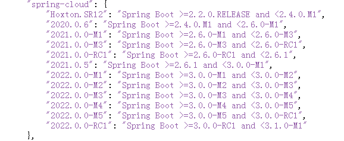


## 三、关于cloud各种组件的停更、升级、替换

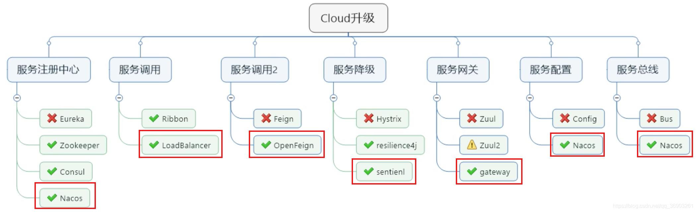


## 四、微服务架构编码构建

编程风格：约定 > 配置 > 编码

创建微服务cloud整体聚合父工厂project步骤

1.new project 

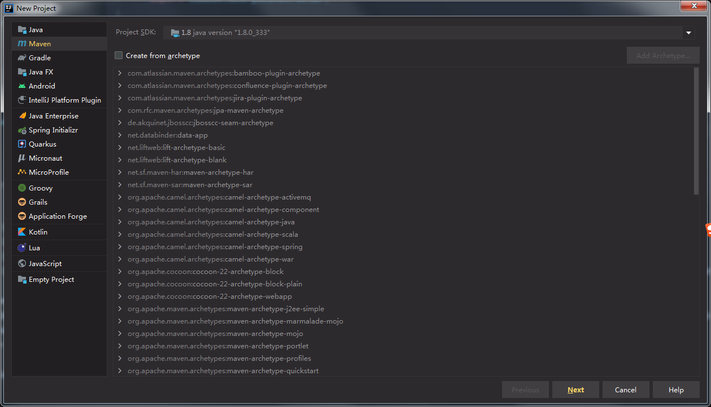


2.聚合总父工程名字

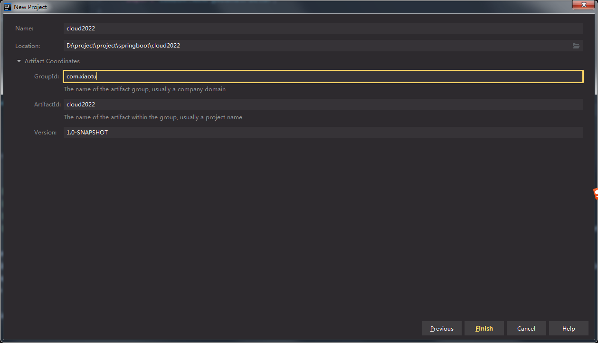


3.Maven选版本

选定和java版本兼容的

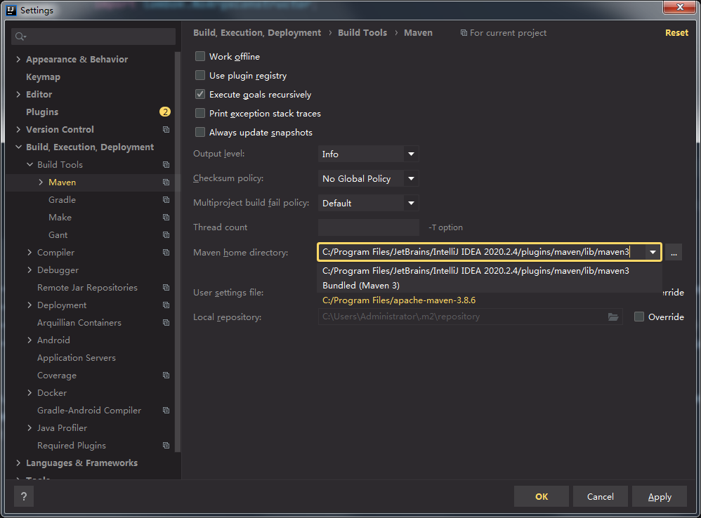


4.开启自动导入


5.字符编码

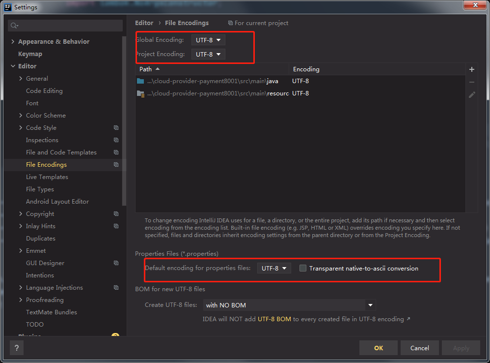


6.注解生效激活

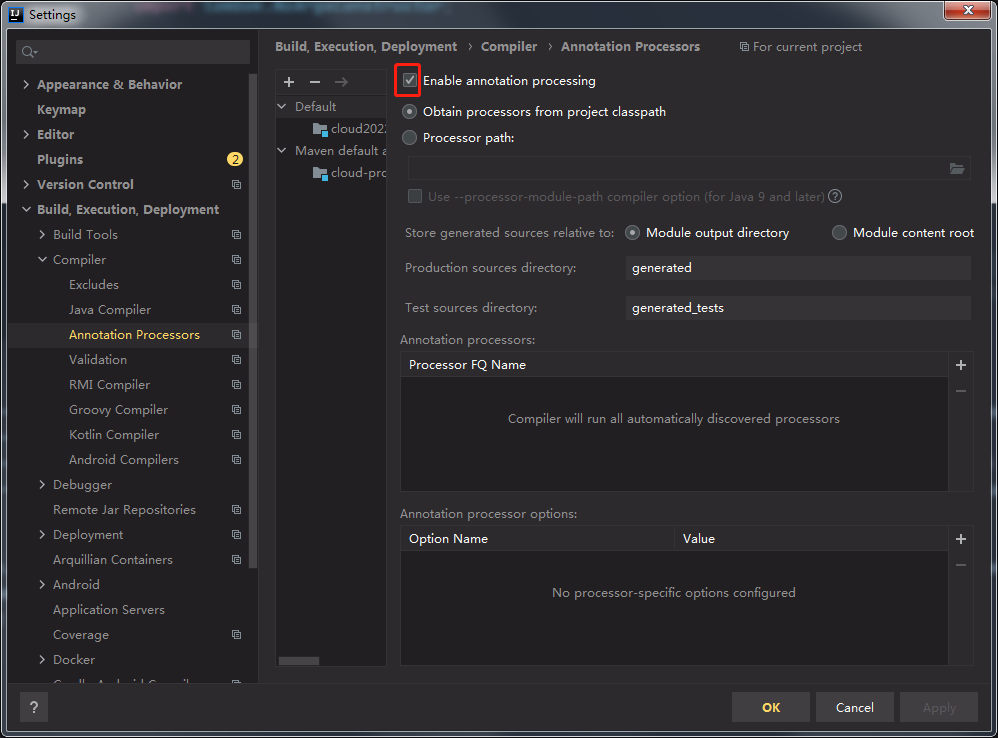


7.java编辑版本8

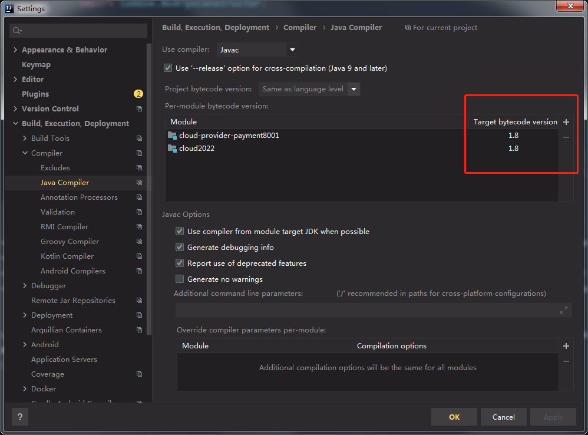


8.File Type过滤

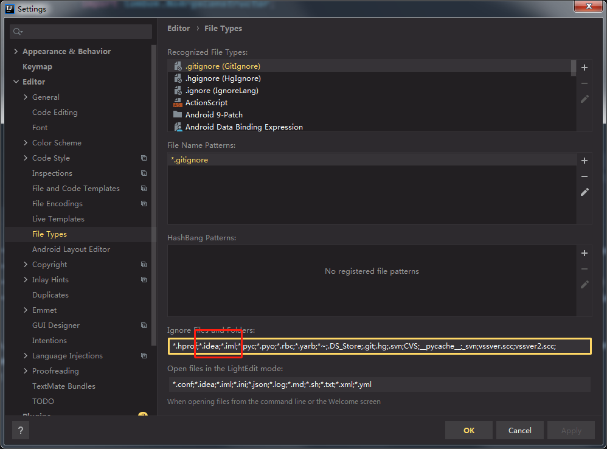


父工程的pom

删除src目录,并添加下方

```xml
 <groupId>com.xiaotu.cloud</groupId>
  <artifactId>cloud2022</artifactId>
  <version>1.0-SNAPSHOT</version>
  <packaging>pom</packaging>
  <modules>
    <module>cloud-provider-payment8001</module>
  </modules>

  <properties>
    <project.build.sourceEncoding>UTF-8</project.build.sourceEncoding>
    <maven.compiler.source>1.8</maven.compiler.source>
    <maven.compiler.target>1.8</maven.compiler.target>
    <!-- junit lombok log4j mysql druid mybatis -->
    <junit.version>4.13.1</junit.version>
    <lombok.version>1.18.16</lombok.version>
    <log4j2.version>2.13.3</log4j2.version>
    <mysql.version>8.0.22</mysql.version>

    <druid.version>1.1.13</druid.version>
    <mybatis.spring.boot.version>1.3.2</mybatis.spring.boot.version>

  </properties>

  <!--子模块继承之后，提供作用：锁定版本+子module 不用写groupId和version-->
  <dependencyManagement>
    <dependencies>
      <dependency>
        <groupId>org.springframework.boot</groupId>
        <artifactId>spring-boot-dependencies</artifactId>
        <version>2.3.7.RELEASE</version>
        <type>pom</type>
        <scope>import</scope>
      </dependency>

      <dependency>
        <groupId>org.springframework.cloud</groupId>
        <artifactId>spring-cloud-dependencies</artifactId>
        <version>Greenwich.SR3</version>
        <type>pom</type>
        <scope>import</scope>
      </dependency>

      <dependency>
        <groupId>com.alibaba.cloud</groupId>
        <artifactId>spring-cloud-alibaba-dependencies</artifactId>
        <version>2.1.0.RELEASE</version>
        <type>pom</type>
        <scope>import</scope>
      </dependency>

      <dependency>
        <groupId>mysql</groupId>
        <artifactId>mysql-connector-java</artifactId>
        <version>${mysql.version}</version>
        <scope>runtime</scope>
      </dependency>

      <dependency>
        <groupId>com.alibaba</groupId>
        <artifactId>druid-spring-boot-starter</artifactId>
        <version>${druid.version}</version>
      </dependency>

      <dependency>
        <groupId>org.mybatis.spring.boot</groupId>
        <artifactId>mybatis-spring-boot-starter</artifactId>
        <version>${mybatis.spring.boot.version}</version>
      </dependency>

      <dependency>
        <groupId>junit</groupId>
        <artifactId>junit</artifactId>
        <version>${junit.version}</version>
        <scope>test</scope>
      </dependency>

      <dependency>
        <groupId>log4j</groupId>
        <artifactId>log4j</artifactId>
        <version>{log4j.version}</version>
      </dependency>

      <dependency>
        <groupId>org.projectlombok</groupId>
        <artifactId>lombok</artifactId>
        <version>${lombok.version}</version>
      </dependency>
    </dependencies>

  </dependencyManagement>

  <build>
    <plugins>
      <plugin>
        <groupId>org.springframework.boot</groupId>
        <artifactId>spring-boot-maven-plugin</artifactId>
        <configuration>
          <fork>true</fork>
          <addResources>true</addResources>
        </configuration>
      </plugin>
    </plugins>
  </build>
```


maven中dependencyManagement标签：

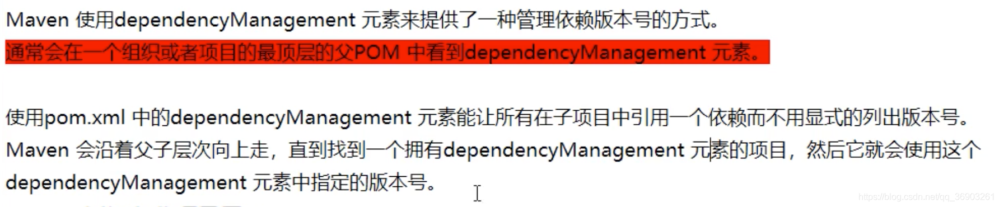

子项目中，如果不指定，默认和父项目dependencyManagement标签中的版本一致，并且父项目dependencyManagement标签只是规定了版本号，具体引入依赖还是子项目引入

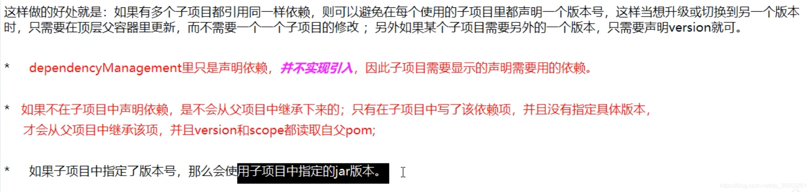


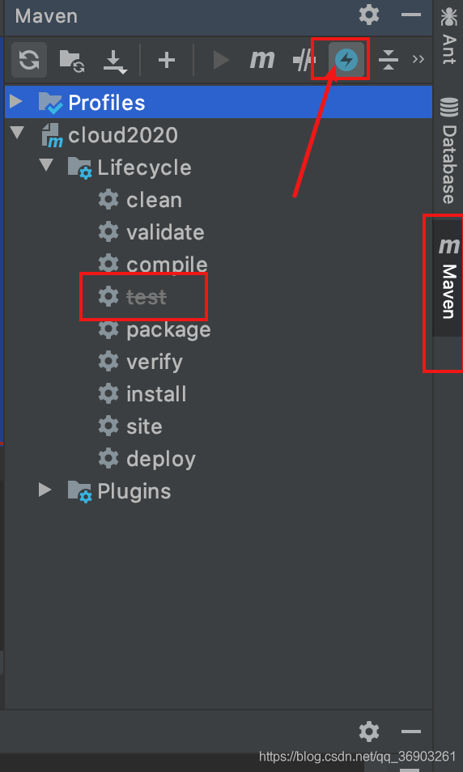


## Rest微服务工程构建

最开始的订单模块

步骤：

1. 建module
2. 改pom
3. 写yml
4. 主启动
5. 业务类
6. 测试


创建子项目

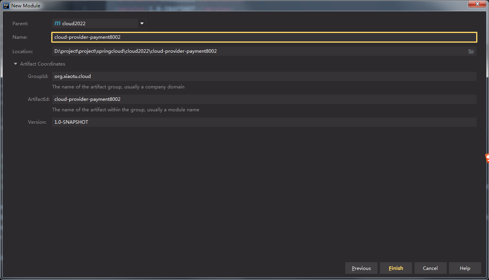


调整父工程的pom，idea可能自动帮处理了

```xml
  <groupId>com.xiaotu.cloud</groupId>
  <artifactId>cloud2022</artifactId>
  <version>1.0-SNAPSHOT</version>
  <packaging>pom</packaging>
  <modules>
    <module>cloud-provider-payment8001</module>
  </modules>
```


增添依赖

```xml-dtd
 <dependencies>
        <dependency>
            <groupId>org.springframework.boot</groupId>
            <artifactId>spring-boot-starter-web</artifactId>
        </dependency>
        <dependency>
            <groupId>org.springframework.boot</groupId>
            <artifactId>spring-boot-starter-actuator</artifactId>
        </dependency>
        <dependency>
            <groupId>org.mybatis.spring.boot</groupId>
            <artifactId>mybatis-spring-boot-starter</artifactId>
        </dependency>
        <dependency>
            <groupId>com.alibaba</groupId>
            <artifactId>druid-spring-boot-starter</artifactId>
            <!--子工程写了版本号 就用子工程版本号-->
        </dependency>

        <dependency>
            <groupId>mysql</groupId>
            <artifactId>mysql-connector-java</artifactId>
        </dependency>
        <dependency>
            <groupId>org.springframework.boot</groupId>
            <artifactId>spring-boot-starter-jdbc</artifactId>
        </dependency>
        <!--热部署-->
        <dependency>
            <groupId>org.springframework.boot</groupId>
            <artifactId>spring-boot-devtools</artifactId>
            <scope>runtime</scope>
            <optional>true</optional>
        </dependency>
        <dependency>
            <groupId>org.projectlombok</groupId>
            <artifactId>lombok</artifactId>
            <optional>true</optional>
        </dependency>
        <dependency>
            <groupId>org.springframework.boot</groupId>
            <artifactId>spring-boot-starter-test</artifactId>
            <scope>test</scope>
        </dependency>

    </dependencies>
```

修改yml文件

```yml
server:
  port: 8001
spring:
  application:
    name: cloud-payment-service
  datasource:
    type: com.alibaba.druid.pool.DruidDataSource
    driver-class-name: com.mysql.cj.jdbc.Driver
    url: jdbc:mysql://localhost:3306/cloud?useUnicode=true&charset=utf-8&useSSL=true&serverTimezone=UTC
    username: root
    password: root
debug: true
#mybaits配置
mybatis:
  mapper-locations: classpath:mapper/*.xml
  type-aliases-package: com.xiaotu.cloud.entities
  configuration:
    log-impl: org.apache.ibatis.logging.stdout.StdOutImpl
    map-underscore-to-camel-case: true
```

Application,entities，dao,mapper,service,serviceIpml,controller  （不赘述了，看下代码都会的）

SQL

```sql
CREATE TABLE `cloud`  (
  `id` bigint(20) NOT NULL AUTO_INCREMENT COMMENT 'id',
  `serial` varchar(200) CHARACTER SET utf8 COLLATE utf8_general_ci NULL DEFAULT '',
  PRIMARY KEY (`id`) USING BTREE
) ENGINE = InnoDB AUTO_INCREMENT = 1 CHARACTER SET = utf8 COLLATE = utf8_general_ci ROW_FORMAT = Dynamic;
```


测试结果

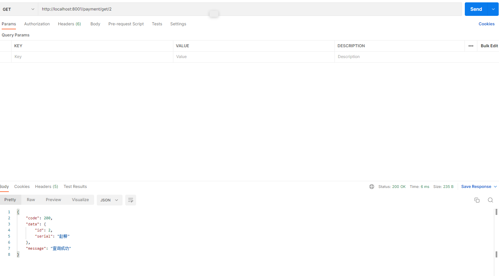


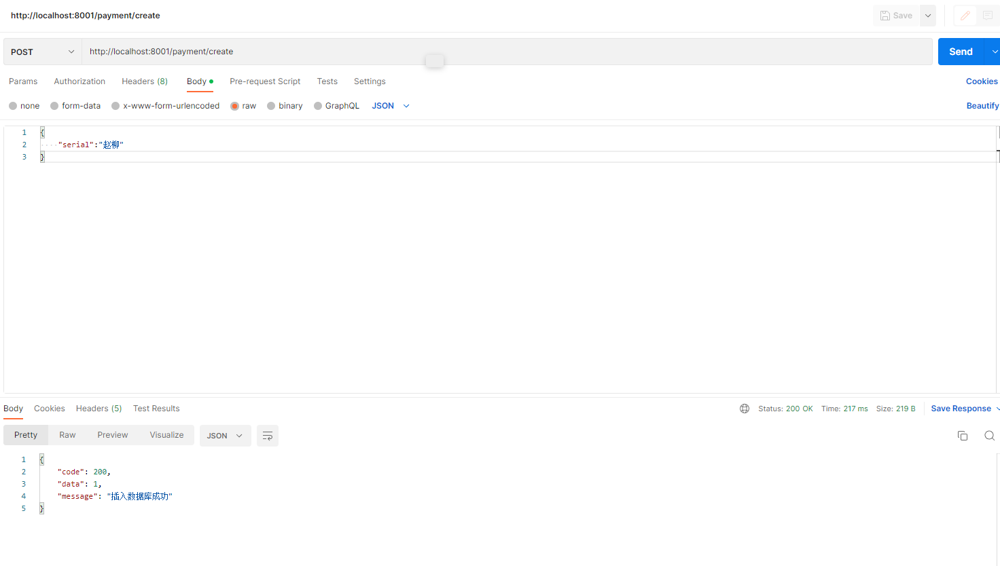


