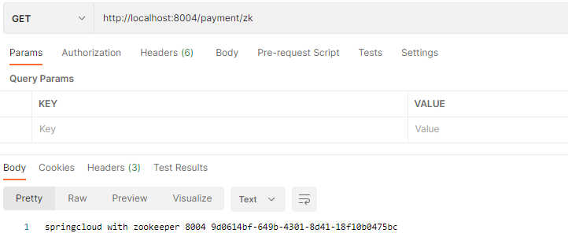
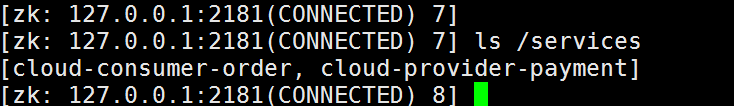
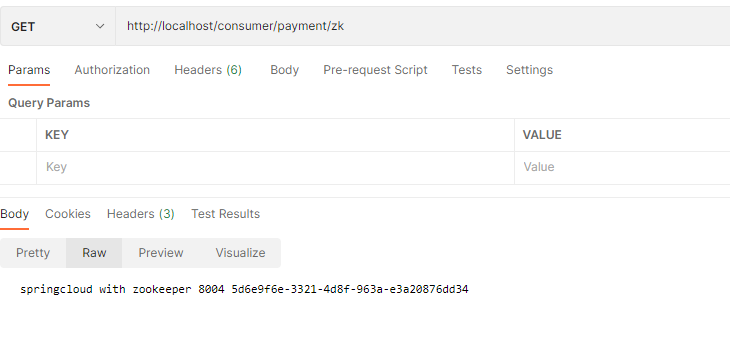

# 六、[Zookeeper](https://so.csdn.net/so/search?q=Zookeeper&spm=1001.2101.3001.7020)服务注册与发现


注册中心Zookeeper

- 分布式协调工具，可以实现注册中心功能
- 关闭Linux服务器防火墙后启动zookeeper服务器
- zoomkeeper服务器取代Eureka服务器，zk作为服务注册中心

关闭linux防火墙

```sh
systemctl stop firewalld
systemctel status firewalld
```


使用docker启动Zookeeper

```
docker pull zookeeper
docker run --name zk01 2181:2181 --restart always -d zookeeper
```

#### 服务节点是临时节点还是持久节点？

zookeeper也是有心跳机制，在一定时间能如果一直没心跳返回，Zookeeper就会把服务节点剔除掉。所以在Zookeeper上的服务节点是临时节点

## 服务提供者

1.新建工程cloud-provider-payment8004

2.pom

```xml
<dependy>
     <groupId>org.springframework.cloud</groupId>
            <artifactId>spring-cloud-starter-netflix-eureka-client</artifactId>
            <version>2.1.3.RELEASE</version>
</dependy>
```

3.yml

```yml
server:
  port: 8004
spring:
  application:
    name: cloud-provider-payment
  cloud:
    zookeeper:
      connect-string: 10.0.41.31:2181
```


4.主启动类

```java
@EnableDiscoveryClient //用于向使用consul或Zookeeper作为注册中心时注册服务
@SpringBootApplication
public class PaymentMain8004 {
    public static void main(String[] args) {
        SpringApplication.run(PaymentMain8004.class,args);
    }
}
```


5.controller

```java
@Slf4j
@RestController
public class PaymentController {

    @Value("${server.port}")
    private String serverPort;

    @RequestMapping("/payment/zk")
    public String paymentzk(){
        return "springcloud with zookeeper "+ serverPort + "\t" + UUID.randomUUID().toString();
    }
}
```

6.Zookeeper容器

```sh
docker ps
docker exec -it 容器ID /bin/bash
exit
docker start 容器ID
docker stop 容器ID
```

7.启动8004容器，输入`http://localhost:8004/payment/zk`

8.启动zookeeper容器 （成功进入注册中心)



