# 十五、SpringCloud Stream消息驱动

官网：https://spring.io/projects/spring-cloud-stream#overview

API：https://cloud.spring.io/spring-cloud-static/spring-cloud-stream/3.0.1.RELEASE/reference/html/


## 消息驱动之生产者

1. 新建模块cloud-stream-rabbitmq-provider8801

2. pom

   ```xml
       <dependencies>
           <dependency>
               <groupId>org.springframework.cloud</groupId>
               <artifactId>spring-cloud-starter-stream-rabbit</artifactId>
           </dependency>
           <dependency>
               <groupId>org.springframework.cloud</groupId>
               <artifactId>spring-cloud-starter-netflix-eureka-client</artifactId>
           </dependency>
           <dependency>
               <groupId>org.springframework.boot</groupId>
               <artifactId>spring-boot-starter-web</artifactId>
           </dependency>
           <dependency>
               <groupId>org.springframework.boot</groupId>
               <artifactId>spring-boot-starter-actuator</artifactId>
           </dependency>
           <dependency>
               <groupId>org.springframework.boot</groupId>
               <artifactId>spring-boot-devtools</artifactId>
               <scope>runtime</scope>
               <optional>true</optional>
           </dependency>
           <dependency>
               <groupId>org.springframework.boot</groupId>
               <artifactId>spring-boot-starter-test</artifactId>
               <scope>test</scope>
           </dependency>
       </dependencies>
   ```

3. yml

   ```yml
   server:
     port: 8801
   
   spring:
     application:
       name: cloud-stream-provider
     cloud:
       stream:
         binders:
           defaultRabbit:
             type: rabbit
             environment:
               spring:
                 rabbitmq:
                   host: 10.0.41.31
                   port: 5672
                   username: guest
                   password: guest
         bindings:
           output:
             destination: studyExchange
             content-type: application/json
             binder: defaultRabbit
   eureka:
     client:
       service-url:
         defaultZone: http://localhost:7001/eureka
     instance:
       lease-renewal-interval-in-seconds: 2 #设置心跳时间间隔  默认30s
       lease-expiration-duration-in-seconds: 5 #如果超过5秒就注销节点 默认90s
       instance-id: send-8801.com #在信息列表时显示主机名称
       prefer-ip-address: true #访问的路径变IP地址
   ```

4. 主启动类

   ```java
   @SpringBootApplication
   public class StreamMQMain8001 {
       public static void main(String[] args) {
           SpringApplication.run(StreamMQMain8001.class,args);
       }
   }
   ```

5. 新建service.IMessageProvider接口

   ```java
   public interface IMessageProvider {
       public String send();
   }
   ```

6. 实现接口impl.IMessageProviderImpl

   ```java
   @EnableBinding(Source.class)  //定义消息的推送管道（Source是Spring的）
   public class IMessageProviderImpl implements IMessageProvider {
   
       @Resource
       private MessageChannel  output;//消息发送管道
   
       @Override
       public String send() {
           String serial = UUID.randomUUID().toString();
           output.send(MessageBuilder.withPayload(serial).build());
           System.out.println("************serial="+serial);
           return null;
       }
   }
   ```

7. 新建控制器controller.SendMessageController

   ```java
   @RestController
   public class SendMessageController {
   
       @Resource
       private IMessageProvider iMessageProvider;
   
       @GetMapping("/sendMessage")
       public String sendMessage(){
           return iMessageProvider.send();
       }
   }
   ```

8. 启动7001,8801。

   查看新生的exchanges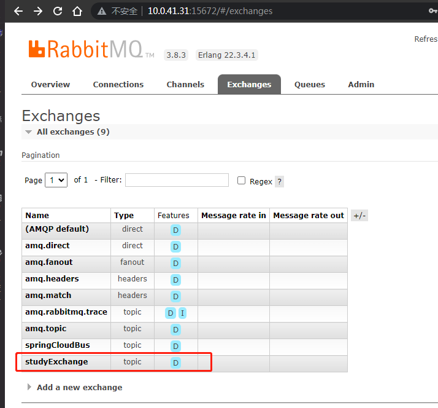

   访问：http://localhost:8801/sendMessage

   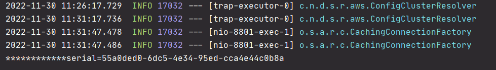

   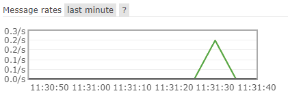

## 消息驱动之消费者

1. 新建模块cloud-stream-rabbitmq-consumer8802

2. pom

   ```xml
   <dependencies>
           <dependency>
               <groupId>org.springframework.cloud</groupId>
               <artifactId>spring-cloud-starter-stream-rabbit</artifactId>
           </dependency>
           <dependency>
               <groupId>org.springframework.cloud</groupId>
               <artifactId>spring-cloud-starter-netflix-eureka-client</artifactId>
           </dependency>
           <dependency>
               <groupId>org.springframework.boot</groupId>
               <artifactId>spring-boot-starter-web</artifactId>
           </dependency>
           <dependency>
               <groupId>org.springframework.boot</groupId>
               <artifactId>spring-boot-starter-actuator</artifactId>
           </dependency>
           <dependency>
               <groupId>org.springframework.boot</groupId>
               <artifactId>spring-boot-devtools</artifactId>
               <scope>runtime</scope>
               <optional>true</optional>
           </dependency>
           <dependency>
               <groupId>org.springframework.boot</groupId>
               <artifactId>spring-boot-starter-test</artifactId>
               <scope>test</scope>
           </dependency>
       </dependencies>
   ```
   
3. yml

   ```yml
   server:
     port: 8802
   spring:
     application:
       name: cloud-stream-consumer
     cloud:
       stream:
         binders:
           defaultRabbit:
             type: rabbit
             environment:
               spring:
                 rabbitmq:
                   host: 10.0.41.31
                   port: 5672
                   username: guest
                   password: guest
         bindings:
           input:
             destination: studyExchange
             content: application/json
             binder: defaultRabbit
   eureka:
     client:
       service-url:
         defaultZone: http://localhost:7001/eureka
     instance:
       lease-renewal-interval-in-seconds: 2
       lease-expiration-duration-in-seconds: 5
       instance-id: receive-8002.com
       prefer-ip-address: true
   ```

4. 主启动类

   ```java
   @SpringBootApplication
   public class StreamMQMain8802 {
       public static void main(String[] args) {
           SpringApplication.run(StreamMQMain8802.class, args);
       }
   }
   ```

5. 新建controller.ReceiveMessageListenerController

   ```java
   @EnableBinding(Sink.class)
   @Controller
   public class ReceiveMessageListenerController {
   
       @Value("${server.port}")
       private String serverPort;
   
       @StreamListener(Sink.INPUT) //监听
       public void input(Message<String> message){
           System.out.println("消费者1号------>收到消息："+ message.getPayload() + "\t port:"+serverPort);
       }
   }
   ```

6. 测试
   启动7001，8801，8802

   访问http://localhost:8801/sendMessage

   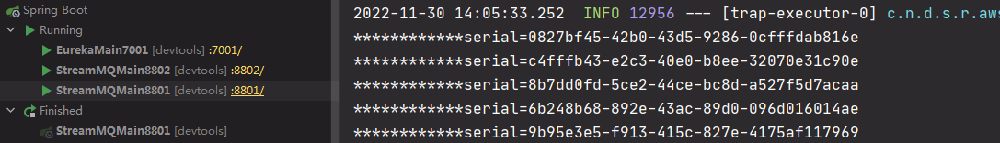

   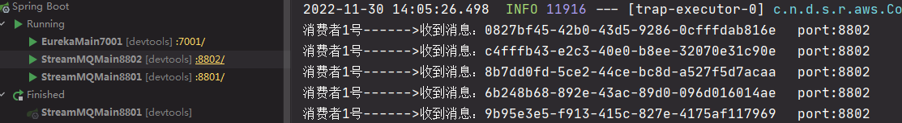

   

## 分组消费与持久化

按照8802，新建8803。

### 消费

8801发送后，8802和8803都能接收到数据（重复消费）；正常情况下应该是有一个消费者消费了8801的消息后，另外的其他消费者就不能消费。这里要把8802和8803看成一个集群，如果8802和8803都接收到了，就都会去做业务，然后本来8801只想让这个集群来做一次消费的，就会变成每个消费者都来消费一次。这是因为8802和8803不是在同一个组（队列）里，不同组可以重复消费，而同一个组里，只有一个消费者能消费，所以需要对消费者进行分组，把所有相同的消费者分到一个组里。（主题会给每个队列发送消息，而每个队列只有一个消费者可以获得消息（同组广播，不同组轮询））


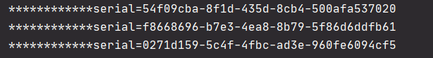

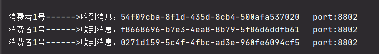

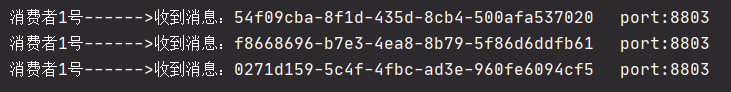


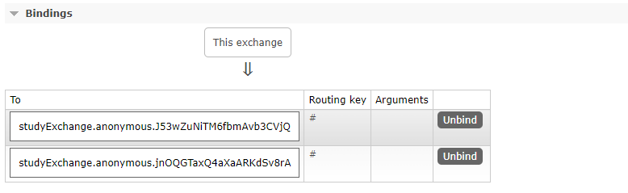


生成实际案例

比如在如下场景中，订单系统我们做集群部署，都从RabbitMQ中获取信息。如果一个订单同时被两个服务获取到，可能会造成数据问题。我们使用分组来解决这种问题。

不同分组：可以重复消费

相同分组：竞争关系，只消费一次

修改8802的yml

```yml
      bindings:
        input:
          destination: studyExchange
          content: application/json
          binder: defaultRabbit
          group: xiaotuA
```

修改8803的yml

```yml
      bindings:
        input:
          destination: studyExchange
          content: application/json
          binder: defaultRabbit
          group: xiaotuB
```

查看mq后台

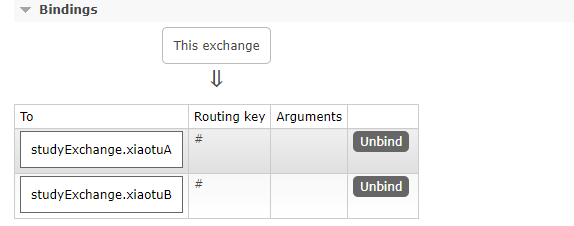

测试发现仍各自消费，再把xiaotuB改为xiaotuA，统一分组。再测试发现同组竞争消费。

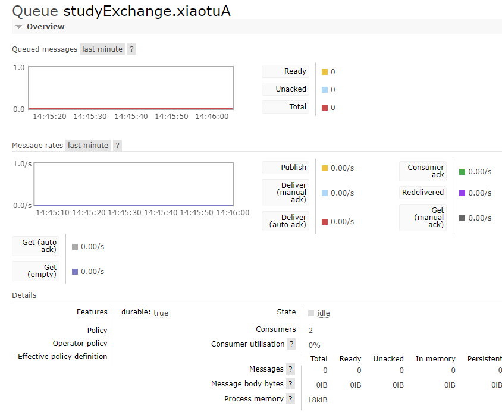

### 持久化

1. 停掉8802和8803，去掉8802的`group: xiaotuA`。

2. 然后8801发送4条消息

3. 启动8802，8802并没有去拿取消息。（因为8802去掉了`group: xiaotuA`，所以启动后会再新建一个队列）

4. 启动8803，启动后获取到8801的消息。（因为8803没删除`group: xiaotuA`，xiaotuA队列是在8801发送消息前存在的，所以当8803停机后再启动，就可以获取到停机时8801发送的信息（如果此时同组（队列）里有别的消费者，那么消息会被别的消费者消费掉））

   
